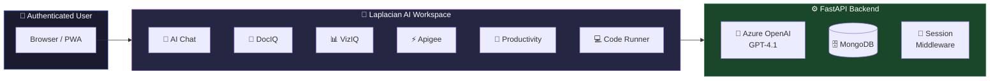
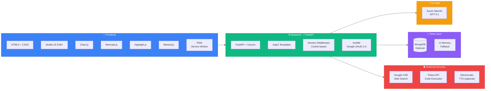
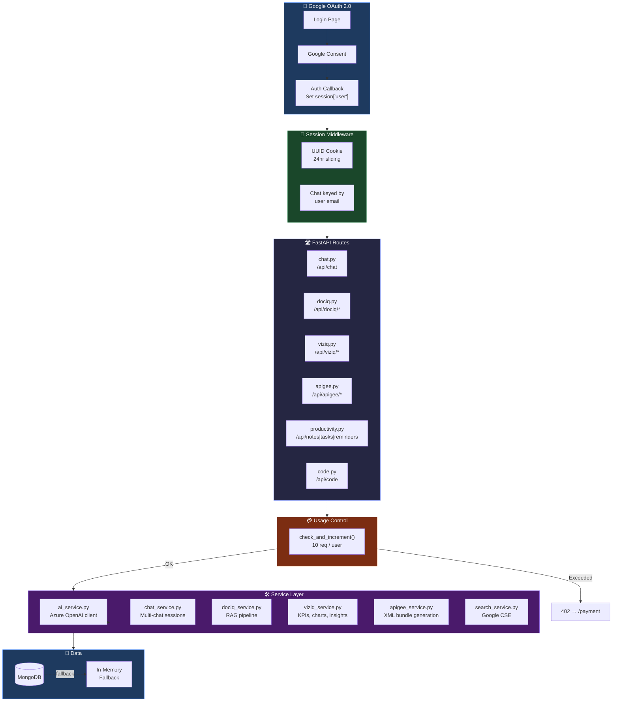
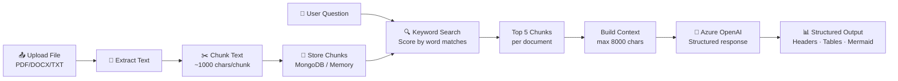
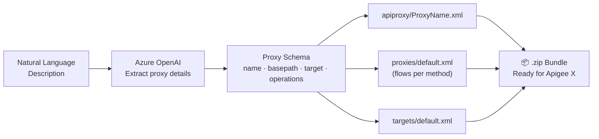
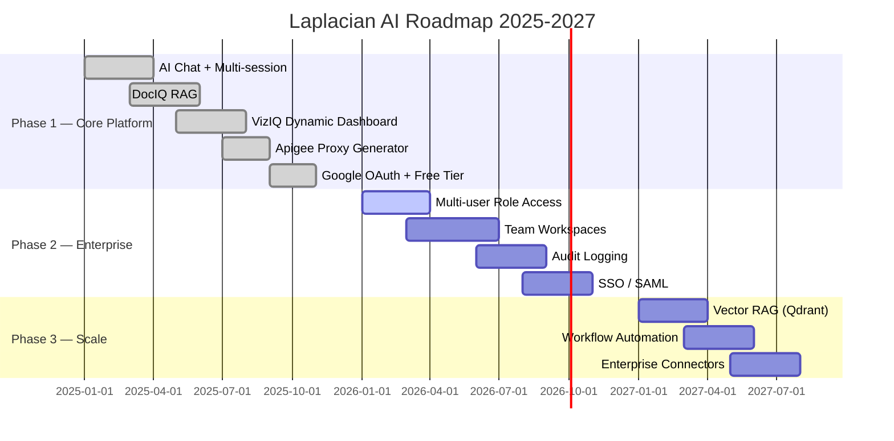

<p align="center">
  
</p>

<h1 align="center">LAPLACIAN AI</h1>
<h3 align="center">Enterprise AI Workspace by Perfionix AI</h3>

<p align="center">
  <strong>AI Chat · Document Intelligence · Data Analytics · API Automation</strong>
</p>

<p align="center">
  <a href="https://www.perfionixai.com">
    
  </a>
  
  
  
  
  
</p>

<p align="center">
  <a href="#overview">Overview</a> •
  <a href="#features">Features</a> •
  <a href="#tech-stack">Tech Stack</a> •
  <a href="#architecture">Architecture</a> •
  <a href="#installation">Installation</a> •
  <a href="#environment-variables">Configuration</a>
</p>

---

## Company Information

| | |
|---|---|
| **Organization** | Perfionix AI Technology Pvt Ltd |
| **Product** | Laplacian AI — Enterprise AI Workspace |
| **Version** | 2.0 |
| **Founder & CEO** | Shubham Rahangdale |
| **Headquarters** | India |
| **Website** | [www.perfionixai.com](https://www.perfionixai.com) |
| **Contact** | connect@perfionixai.com |
| **Industry** | Artificial Intelligence / Enterprise Software |

---

## Overview

**Laplacian AI** is a full-stack enterprise AI workspace built on **FastAPI** and powered by **Azure OpenAI (GPT-4.1)**. It delivers a unified platform for AI-assisted chat, document intelligence, data visualization, API proxy generation, and productivity — all secured behind Google OAuth 2.0 and accessible as a Progressive Web App.


```mermaid
flowchart LR
    subgraph USER["👤 Authenticated User"]
        BROWSER["Browser / PWA"]
    end

    subgraph WORKSPACE["🚀 Laplacian AI Workspace"]
        CHAT["💬 AI Chat"]
        DOCIQ["📄 DocIQ"]
        VIZIQ["📊 VizIQ"]
        APIGEE["⚡ Apigee"]
        PROD["📝 Productivity"]
        CODE["💻 Code Runner"]
    end

    subgraph BACKEND["⚙️ FastAPI Backend"]
        AZURE["🧠 Azure OpenAI\nGPT-4.1"]
        MONGO[("🗄️ MongoDB")]
        SESSION["🔐 Session\nMiddleware"]
    end

    BROWSER --> WORKSPACE
    WORKSPACE --> BACKEND

    style USER fill:#1a1b2e,stroke:#667eea,color:#fff
    style WORKSPACE fill:#252642,stroke:#764ba2,color:#fff
    style BACKEND fill:#1a472a,stroke:#2d7a4a,color:#fff
```

---

## Features

### 💬 AI Chat — Multi-Session Conversational Intelligence

The core of Laplacian AI — a powerful, multi-session chat interface with web search, image vision, and message editing.

**Capabilities:**
- Multiple independent chat sessions per user, persistent across logins (keyed by Google account email)
- Real-time web search via Google Custom Search Engine — AI cites sources inline
- Image upload + visual analysis (GPT-4.1 vision)
- Edit any past user message and regenerate from that point
- Follow-up suggestion chips after every AI response
- Mermaid diagram rendering inline in chat
- Code blocks with syntax highlighting (Highlight.js)
- Model selector — Core / Lite / Coder / Max (all powered by the same Azure OpenAI deployment)
- Voice input (Web Speech API)

---

### 📄 DocIQ — Document Intelligence (RAG)

Upload documents and ask questions in natural language. DocIQ extracts, chunks, and searches your files to produce structured AI responses.

**Capabilities:**
- Upload PDF, DOCX, DOC, TXT files
- Keyword-based RAG search across all uploaded documents
- Structured AI responses with tables, bullet points, and auto-generated Mermaid diagrams
- Multi-document analysis in a single session
- One-click document summary with structured overview
- Session-isolated document storage per user

**Supported Formats:**

| Format | Extension | Processing |
|--------|-----------|------------|
| PDF | `.pdf` | PyPDF2 extraction |
| Word | `.docx`, `.doc` | python-docx parsing |
| Text | `.txt` | Direct read |

---

### 📊 VizIQ — Dynamic Data Intelligence Dashboard

A PowerBI-alternative dashboard that transforms raw data files into interactive, AI-powered analytics — entirely in the browser.

**Capabilities:**
- Upload CSV, Excel (.xlsx/.xls), or JSON
- Auto-generated dashboard with smart naming based on column context (Sales Analytics, HR Analytics, etc.)
- Up to 8 dynamic KPI cards with trend indicators (▲ / ▼ / →) and % change
- 5 chart types auto-generated per dataset:
  - **Bar chart** — top categories ranked by numeric value (up to 12 bars)
  - **Doughnut chart** — category distribution (up to 8 slices)
  - **Multi-series bar** — compare two numeric columns across avg/max/min/median
  - **Scatter plot** — correlation between two numeric columns (up to 300 points)
  - **Trend line** — sequential trend over up to 100 data points
- **Chart type toggle** per chart — switch bar ↔ line ↔ doughnut without re-uploading
- **Download chart as PNG** — one click per chart
- **Filter/Slicer bar** — PowerBI-style categorical dropdowns filter the data table live
- **Export CSV** — download preview data
- **Table search** — real-time search across all columns
- AI Insights panel: data quality %, growth rate, IQR outlier detection, column summaries, category leaders
- Paginated data preview table (10 rows/page)

**Supported Formats:**

| Format | Extension |
|--------|-----------|
| CSV | `.csv` |
| Excel | `.xlsx`, `.xls` |
| JSON | `.json` |

---

### ⚡ Apigee — API Proxy Bundle Generator

Describe your API in plain English — Laplacian AI generates a complete, production-ready Apigee API proxy bundle as a downloadable ZIP.

**Capabilities:**
- Natural language input → Azure OpenAI extracts proxy name, base path, target URL, and REST operations
- Generates valid Apigee XML configuration files:
  - `apiproxy/<ProxyName>.xml` — proxy descriptor
  - `apiproxy/proxies/default.xml` — proxy endpoint with flows per HTTP method
  - `apiproxy/targets/default.xml` — target endpoint
- Returns a `.zip` bundle ready for Apigee X / Apigee Edge deployment
- Live XML preview before download

---

### 💻 Code Runner — Sandboxed Execution

Execute code snippets directly from the chat or the dedicated code view, with results returned inline.

**Supported Languages (via Piston API):**
Python, JavaScript, TypeScript, Java, C, C++, C#, Go, Rust, Ruby, PHP, Swift, Kotlin, and more.

---

### 📝 Productivity Suite

Integrated personal workspace tools, stored per-user in MongoDB (or in-memory fallback).

| Tool | Description |
|------|-------------|
| **Tasks** | Create tasks with priority levels (low/medium/high), mark complete, delete |
| **Notes** | Quick notes with title + content, timestamped |
| **Reminders** | Schedule reminders with date/time |
| **Stats** | Live dashboard: total/completed/pending tasks, note count, reminder count |

---

### 🔐 Authentication & Free Tier

- **Google OAuth 2.0** — login required for all features
- **Free tier**: 10 AI requests per account (shared across Chat, DocIQ, VizIQ)
- Exceeded users are redirected to the upgrade/payment page
- Session persists 24 hours (sliding window cookie)

---

## Tech Stack


```mermaid
flowchart LR
    subgraph FRONTEND["🎨 Frontend"]
        HTML["HTML5 + CSS3"]
        JS["Vanilla JS ES6+"]
        CHARTJS["Chart.js"]
        MERMAIDJS["Mermaid.js"]
        HLJS["Highlight.js"]
        MARKED["Marked.js"]
        PWA["PWA\nService Worker"]
    end

    subgraph BACKEND["⚙️ Backend — FastAPI"]
        FASTAPI["FastAPI + Uvicorn"]
        JINJA["Jinja2 Templates"]
        MIDDLEWARE["Session Middleware\nCookie-based"]
        AUTHLIB["Authlib\nGoogle OAuth 2.0"]
    end

    subgraph AI["🧠 AI Layer"]
        AZURE["Azure OpenAI\nGPT-4.1"]
    end

    subgraph DATA["💾 Data Layer"]
        MONGO[("MongoDB\nOptional")]
        MEMORY["In-Memory\nFallback"]
    end

    subgraph EXTERNAL["🌐 External Services"]
        GCSE["Google CSE\nWeb Search"]
        PISTON["Piston API\nCode Execution"]
        ELEVENLABS["ElevenLabs\nTTS (optional)"]
    end

    FRONTEND --> BACKEND
    BACKEND --> AI
    BACKEND --> DATA
    BACKEND --> EXTERNAL

    style FRONTEND fill:#3b82f6,stroke:#1d4ed8,color:#fff
    style BACKEND fill:#10b981,stroke:#059669,color:#fff
    style AI fill:#f59e0b,stroke:#d97706,color:#fff
    style DATA fill:#8b5cf6,stroke:#7c3aed,color:#fff
    style EXTERNAL fill:#ef4444,stroke:#dc2626,color:#fff
```

### Backend

| Layer | Technology | Purpose |
|-------|------------|---------|
| **Web Framework** | FastAPI + Uvicorn | Async REST API, routing, dependency injection |
| **Templates** | Jinja2 | Server-side HTML rendering |
| **Session** | Custom cookie middleware | In-memory session store, 24hr sliding window |
| **Auth** | Authlib (Google OAuth 2.0) | Secure login, user identity |
| **AI** | Azure OpenAI SDK (`openai`) | GPT-4.1 chat completions |
| **Database** | MongoDB (pymongo) | Chat messages, documents, tasks, notes, usage |
| **Fallback** | In-memory dicts | Runs fully without MongoDB |

### Frontend

| Technology | Purpose |
|------------|---------|
| **Vanilla JS (ES6+)** | All interactivity — single `LaplacianAssistant` class |
| **Chart.js** | VizIQ data visualizations |
| **Mermaid.js** | Diagram rendering in chat and DocIQ |
| **Highlight.js** | Code syntax highlighting |
| **Marked.js** | Markdown parsing |
| **PWA** | Service worker + manifest — installable as desktop/mobile app |

### AI Models

All four model variants route to the **same Azure OpenAI deployment** — the labels are for branding only.

| Label | Description |
|-------|-------------|
| **Laplacian Core** | General-purpose, complex reasoning |
| **Laplacian Lite** | Fast responses |
| **Laplacian Coder** | Code generation and debugging |
| **Laplacian Max** | Extended tasks |

---

## Architecture

### System Workflow


```mermaid
flowchart TB
    subgraph AUTH["🔐 Google OAuth 2.0"]
        LOGIN["Login Page"] --> GOOGLE["Google Consent"]
        GOOGLE --> CALLBACK["Auth Callback\nSet session['user']"]
    end

    subgraph MIDDLEWARE["🔀 Session Middleware"]
        COOKIE["UUID Cookie\n24hr sliding"]
        USEREMAIL["Chat keyed by\nuser email"]
    end

    subgraph ROUTES["🛣️ FastAPI Routes"]
        CHAT_R["chat.py\n/api/chat"]
        DOCIQ_R["dociq.py\n/api/dociq/*"]
        VIZIQ_R["viziq.py\n/api/viziq/*"]
        APIGEE_R["apigee.py\n/api/apigee/*"]
        PROD_R["productivity.py\n/api/notes|tasks|reminders"]
        CODE_R["code.py\n/api/code"]
    end

    subgraph SERVICES["🛠️ Service Layer"]
        AI_SVC["ai_service.py\nAzure OpenAI client"]
        CHAT_SVC["chat_service.py\nMulti-chat sessions"]
        DOCIQ_SVC["dociq_service.py\nRAG pipeline"]
        VIZIQ_SVC["viziq_service.py\nKPIs, charts, insights"]
        APIGEE_SVC["apigee_service.py\nXML bundle generation"]
        SEARCH_SVC["search_service.py\nGoogle CSE"]
    end

    subgraph USAGE["💳 Usage Control"]
        CHECK["check_and_increment()\n10 req / user"]
    end

    subgraph DB["💾 Data"]
        MONGO[("MongoDB")]
        INMEM["In-Memory\nFallback"]
    end

    CALLBACK --> MIDDLEWARE
    MIDDLEWARE --> ROUTES
    ROUTES --> USAGE
    USAGE -->|"OK"| SERVICES
    USAGE -->|"Exceeded"| PAYMENT["402 → /payment"]
    SERVICES --> AI_SVC
    SERVICES --> DB
    MONGO -.->|"fallback"| INMEM

    style AUTH fill:#1e3a5f,stroke:#3b82f6,color:#fff
    style MIDDLEWARE fill:#1a472a,stroke:#2d7a4a,color:#fff
    style ROUTES fill:#252642,stroke:#667eea,color:#fff
    style SERVICES fill:#4a1a6b,stroke:#8b5cf6,color:#fff
    style USAGE fill:#7c2d12,stroke:#f97316,color:#fff
    style DB fill:#1e3a5f,stroke:#3b82f6,color:#fff
```

### Multi-Chat Session Architecture

Chat history is keyed by the user's **Google account email**, ensuring sessions persist across browser sessions and device changes (server-memory scope).

```
_chat_sessions = {
    "user@gmail.com": {
        "<chat_uuid>": {
            "messages": [ system, user, assistant, ... ],
            "title": "First message as title",
            "created_at": "...",
            "updated_at": "..."
        },
        ...
    }
}
```

### DocIQ RAG Pipeline


```mermaid
flowchart LR
    UPLOAD["📤 Upload File\nPDF/DOCX/TXT"] --> EXTRACT["📝 Extract Text"]
    EXTRACT --> CHUNK["✂️ Chunk Text\n~1000 chars/chunk"]
    CHUNK --> STORE["💾 Store Chunks\nMongoDB / Memory"]
    QUERY["💬 User Question"] --> SEARCH["🔍 Keyword Search\nScore by word matches"]
    STORE --> SEARCH
    SEARCH --> TOPK["Top 5 Chunks\nper document"]
    TOPK --> CONTEXT["Build Context\nmax 8000 chars"]
    CONTEXT --> AZURE["🧠 Azure OpenAI\nStructured response"]
    AZURE --> RESPONSE["📊 Structured Output\nHeaders · Tables · Mermaid"]
```

### Apigee Proxy Generation Flow


```mermaid
flowchart LR
    NL["Natural Language\nDescription"] --> AI["Azure OpenAI\nExtract proxy details"]
    AI --> SCHEMA["Proxy Schema\nname · basepath · target · operations"]
    SCHEMA --> XML1["apiproxy/ProxyName.xml"]
    SCHEMA --> XML2["proxies/default.xml\n(flows per method)"]
    SCHEMA --> XML3["targets/default.xml"]
    XML1 & XML2 & XML3 --> ZIP["📦 .zip Bundle\nReady for Apigee X"]
```

---

## Project Structure

```
laplacian-ai/
├── run.py                          # Entry point (uvicorn, port 5000)
├── database.py                     # MongoDB singleton + all DB operations
├── requirements.txt
├── .env                            # Environment variables (see below)
│
├── app/
│   ├── __init__.py                 # create_app() factory
│   │
│   ├── config/
│   │   ├── settings.py             # All env vars loaded here
│   │   └── constants.py            # AI_MODELS dict, PISTON_LANGUAGES
│   │
│   ├── middleware/
│   │   └── session.py              # Cookie-keyed in-memory session (24hr sliding)
│   │
│   ├── routes/
│   │   ├── __init__.py             # register_routers()
│   │   ├── main.py                 # GET /, /login, /favicon.ico, /sw.js
│   │   ├── auth.py                 # /auth/login|callback|logout, /api/auth/user
│   │   ├── chat.py                 # /api/chat, /api/chat/edit|reset|history|new|load
│   │   ├── models.py               # /api/models, /api/models/set
│   │   ├── search.py               # /api/search
│   │   ├── code.py                 # /api/code/execute
│   │   ├── dociq.py                # /api/dociq/upload|documents|chat|summary|clear
│   │   ├── viziq.py                # /api/viziq/upload|data|clear
│   │   ├── apigee.py               # /api/apigee/generate|preview
│   │   ├── productivity.py         # /api/notes|tasks|reminders|stats
│   │   └── payment.py              # /payment, /api/usage
│   │
│   ├── services/
│   │   ├── ai_service.py           # Azure OpenAI client, generate_ai_response()
│   │   ├── chat_service.py         # Multi-chat sessions, chat_with_ai()
│   │   ├── apigee_service.py       # NLP → Apigee XML bundle → ZIP
│   │   ├── dociq_service.py        # RAG: upload, chunk, keyword search, respond
│   │   ├── viziq_service.py        # KPIs, chart configs, insights from data
│   │   ├── productivity_service.py # Notes/Tasks/Reminders CRUD
│   │   ├── search_service.py       # Google CSE web + image search
│   │   └── code_service.py         # Piston API code execution
│   │
│   └── utils/
│       ├── usage.py                # Free-tier tracker (10 req/user)
│       ├── session.py              # get_session_id() helper
│       ├── file_helpers.py         # allowed_file(), secure_filename()
│       ├── text_processing.py      # extract_text_from_document(), chunk_text()
│       └── data_processing.py      # parse_csv/excel/json, statistics
│
├── templates/
│   ├── index.html                  # Main SPA (requires login)
│   ├── login.html                  # Google OAuth login page
│   └── payment.html                # Free tier exceeded / upgrade page
│
├── static/
│   ├── style.css                   # Main stylesheet (~7500 lines)
│   ├── script.js                   # Main frontend JS (~5000 lines)
│   ├── enhancements.css            # Additional UI styles
│   ├── ui-enhancements.js          # Additional UI JS
│   ├── sw.js                       # Service worker (PWA)
│   ├── manifest.json               # PWA manifest
│   └── New lap logo.png            # Brand logo
│
└── uploads/                        # Temporary file storage for DocIQ/VizIQ
```

---

## Installation

### Prerequisites

- Python 3.10+
- MongoDB (optional — app fully works in-memory without it)
- An Azure OpenAI resource with a GPT-4.1 deployment
- A Google Cloud project with OAuth 2.0 credentials

### Quick Start

```bash
# Clone the repository
git clone https://github.com/TR0J49/laplacian-ai.git
cd laplacian-ai

# Create virtual environment
python -m venv venv
source venv/bin/activate        # Windows: venv\Scripts\activate

# Install dependencies
pip install -r requirements.txt

# Configure environment
cp .env.example .env
# Edit .env with your credentials (see below)

# Run the application
python run.py
# → Server starts at http://localhost:5000
```

---

## Environment Variables

```env
# ── Azure OpenAI ──────────────────────────────────────────────
AZURE_OPENAI_ENDPOINT=https://<your-resource>.openai.azure.com/
AZURE_OPENAI_API_KEY=<your-api-key>
AZURE_OPENAI_API_VERSION=2024-02-01
AZURE_OPENAI_DEPLOYMENT=<your-deployment-name>

# ── Google OAuth 2.0 ──────────────────────────────────────────
GOOGLE_CLIENT_ID=<your-google-client-id>
GOOGLE_CLIENT_SECRET=<your-google-client-secret>

# ── MongoDB (optional) ────────────────────────────────────────
MONGODB_URI=mongodb://localhost:27017
MONGODB_DATABASE=laplacian_ai

# ── Google Custom Search (optional) ──────────────────────────
GOOGLE_API_KEY=<your-google-api-key>
GOOGLE_CSE_ID=<your-cse-id>

# ── ElevenLabs TTS (optional) ────────────────────────────────
ELEVENLABS_API_KEY=<your-elevenlabs-key>
VOICE_ID=<your-voice-id>

# ── App ───────────────────────────────────────────────────────
SECRET_KEY=<random-secret-for-sessions>
UPLOAD_FOLDER=uploads
```

---

## Dependencies

```
fastapi>=0.110.0          # Web framework
uvicorn[standard]>=0.27.0 # ASGI server
python-multipart>=0.0.6   # File upload support
jinja2>=3.1.2             # HTML templating
openai>=1.0.0             # Azure OpenAI SDK
authlib>=1.3.0            # Google OAuth 2.0
httpx>=0.25.0             # Async HTTP (required by Authlib)
pymongo==4.6.1            # MongoDB driver
dnspython==2.4.2          # MongoDB DNS SRV support
python-dotenv==1.0.0      # .env loading
requests==2.31.0          # HTTP client (search, Piston)
beautifulsoup4==4.12.2    # Web scraping for search
PyPDF2==3.0.1             # PDF text extraction
python-docx==1.1.0        # DOCX text extraction
openpyxl==3.1.2           # Excel file parsing
pydub==0.25.1             # Audio processing (TTS)
SpeechRecognition==3.10.0 # Voice input
```

---

## Key Design Decisions

| Decision | Rationale |
|----------|-----------|
| **Single Azure OpenAI deployment for all model labels** | Branding separation without infrastructure cost; swap deployment name in `.env` to change the actual model |
| **Chat history keyed by Google email** | Persists across browser sessions, devices, and cookie resets — same account always sees the same history |
| **Keyword-based RAG (not vector)** | No embedding model or vector DB required; works offline/on-premise with zero extra infrastructure |
| **MongoDB optional** | Fallback in-memory dicts mean the app runs fully without any database — ideal for demo/dev |
| **Apigee XML generation** | Fills a gap for teams prototyping API gateway configs without manual XML authoring |
| **PWA** | Users can install Laplacian AI as a desktop or mobile app with offline shell |

---

## Roadmap


```mermaid
gantt
    title Laplacian AI Roadmap 2025-2027
    dateFormat  YYYY-MM
    section Phase 1 — Core Platform
    AI Chat + Multi-session     :done, 2025-01, 2025-04
    DocIQ RAG                   :done, 2025-03, 2025-06
    VizIQ Dynamic Dashboard     :done, 2025-05, 2025-08
    Apigee Proxy Generator      :done, 2025-07, 2025-09
    Google OAuth + Free Tier    :done, 2025-09, 2025-11

    section Phase 2 — Enterprise
    Multi-user Role Access      :active, 2026-01, 2026-04
    Team Workspaces             :2026-03, 2026-07
    Audit Logging               :2026-06, 2026-09
    SSO / SAML                  :2026-08, 2026-11

    section Phase 3 — Scale
    Vector RAG (Qdrant)         :2027-01, 2027-04
    Workflow Automation         :2027-03, 2027-06
    Enterprise Connectors       :2027-05, 2027-08
```

### Phase 1 — Core Platform ✅
- [x] AI Chat with multi-session, email-persistent history
- [x] Web search with inline citations
- [x] Image vision (GPT-4.1)
- [x] DocIQ document RAG
- [x] VizIQ dynamic dashboard with scatter, filters, export
- [x] Apigee proxy bundle generator
- [x] Google OAuth 2.0
- [x] Free tier (10 requests) + payment gate
- [x] PWA support

### Phase 2 — Enterprise 🚧
- [ ] Multi-user role-based access control
- [ ] Team workspaces with shared sessions
- [ ] Full audit logging
- [ ] SSO / SAML integration

### Phase 3 — Scale 📋
- [ ] Vector-based RAG (Qdrant / Weaviate)
- [ ] Workflow automation engine
- [ ] Enterprise system connectors (Salesforce, SAP, Jira)

---

## Support

| Channel | Contact |
|---------|---------|
| **Email** | connect@perfionixai.com |
| **Website** | [www.perfionixai.com](https://www.perfionixai.com) |
| **Issues** | GitHub Issues |

---

## License

Copyright © 2026 Perfionix AI Technology Pvt Ltd. All rights reserved.

This software is proprietary and confidential. Unauthorized copying, distribution, or use is strictly prohibited.

---

<p align="center">
  
</p>

<p align="center">
  <strong>Built with ❤️ in India by Perfionix AI</strong>
</p>

<p align="center">
  <em>"Enterprise intelligence, built to last."</em>
</p>

<p align="center">
  <a href="https://www.perfionixai.com">www.perfionixai.com</a> |
  <a href="mailto:connect@perfionixai.com">connect@perfionixai.com</a>
</p>
