<p align="center">
  
</p>

<h1 align="center">LAPLACIAN</h1>
<h3 align="center">AI Code Assistant & Productivity Platform</h3>

<p align="center">
  <strong>by Perfionix AI Technology Pvt Ltd</strong>
</p>
<p align="center">
  
  
  
  
</p>

<p align="center">
  
  
  
</p>

---

## Company Information

| Field | Details |
|-------|---------|
| **Company** | Perfionix AI Technology Pvt Ltd |
| **Product** | LAPLACIAN v2.0 |
| **Founder** | Shubham Rahangdale |
| **Email** | connect@perfionixai.com |
| **Status** | Production Ready |

---

## Executive Summary

**LAPLACIAN** is an enterprise-grade AI-powered code assistant and productivity platform developed by **Perfionix AI Technology Pvt Ltd**. It combines cutting-edge Large Language Models with modern web technologies to deliver an intelligent, privacy-focused solution for developers, analysts, and professionals.

### Platform Highlights

| Metric | Value |
|--------|-------|
| **Total Modules** | 6 Integrated Modules |
| **AI Models** | 2 (Core, Coder) |
| **Document Formats** | PDF, DOCX, TXT |
| **Data Formats** | CSV, XLSX, JSON |
| **Chart Types** | 4 Auto-Generated |
| **Code Languages** | 10+ Syntax Highlighted |
| **Diagram Types** | 15+ Mermaid Diagrams |

---

## Key Features Overview

### Feature Matrix

| Module | Feature | Description |
|--------|---------|-------------|
| **Chat** | Multi-Model AI | Switch between Core, Lite, and Coder models |
| **Chat** | Web Search | Real-time web search with AI summarization |
| **Chat** | Code Execution | Run HTML/CSS/JS in live preview |
| **Chat** | Mermaid Diagrams | Auto-render flowcharts, sequences, etc. |
| **Chat** | Message Editing | Edit past messages and regenerate |
| **Chat** | Generation Controls | Pause, Continue, Stop AI responses |
| **DocIQ** | RAG Q&A | Chat with uploaded documents |
| **VizIQ** | Auto Dashboards | Instant KPIs and charts from data |
| **Tasks** | Task Management | Priority-based task tracking |
| **Notes** | Note Taking | Card-based notes with timestamps |
| **Reminders** | Scheduling | Date/time reminder alerts |

---

## Chat System - Complete Features

### 1. Multi-Model AI Selection

| Model | ID | Description | Use Case |
|-------|-----|-------------|----------|
| **LAPLACIAN Core** | `gpt` | `gpt-oss:20b-cloud` | General thinking, complex reasoning |
| **LAPLACIAN Coder** | `coder` | `qwen3-coder:480b-cloud` | Code generation, debugging |

**Features:**
- Dropdown selector in header
- Real-time model switching
- Availability checking on startup
- Notification on model change

---

### 2. Web Search Integration
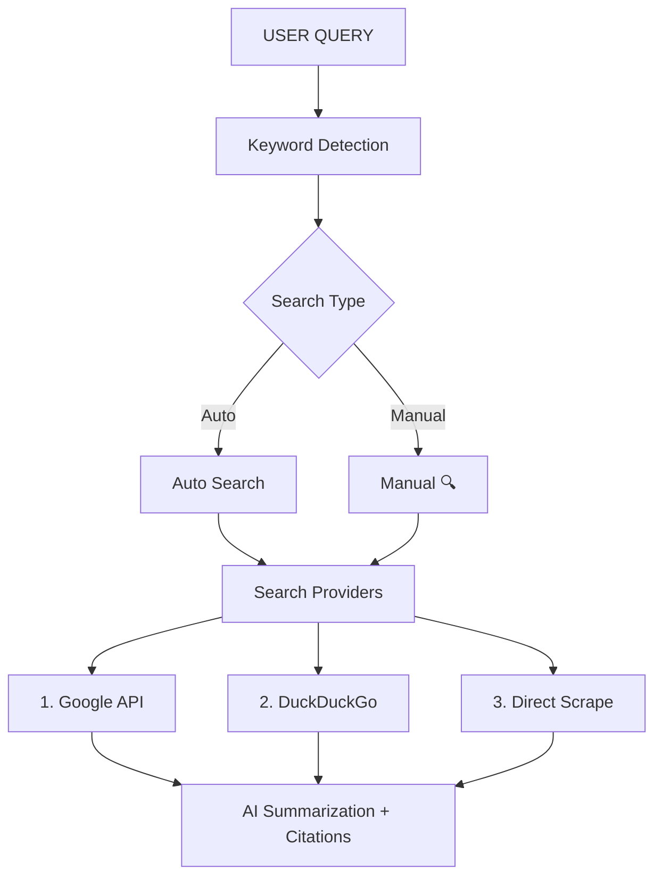
```mermaid
flowchart TD
    A[USER QUERY] --> B[Keyword Detection]
    B --> C{Search Type}
    C -->|Auto| D[Auto Search]
    C -->|Manual| E["Manual 🔍"]
    D --> F[Search Providers]
    E --> F
    F --> G[1. Google API]
    F --> H[2. DuckDuckGo]
    F --> I[3. Direct Scrape]
    G --> J[AI Summarization + Citations]
    H --> J
    I --> J
```
#### Trigger Keywords
| Category | Keywords |
|----------|----------|
| **Search** | `search`, `google`, `find`, `look up` |
| **Questions** | `what is`, `who is`, `when did` |
| **Time** | `latest`, `recent`, `news`, `current`, `today` |
| **Year** | `2024`, `2025` |
| **Info** | `price`, `weather`, `definition`, `meaning` |

#### Shortcuts
| Shortcut | Action |
|----------|--------|
| `Ctrl + Enter` | Force web search |
| 🔍 Button | Manual search trigger |

---

### 3. Message Editing & Regeneration
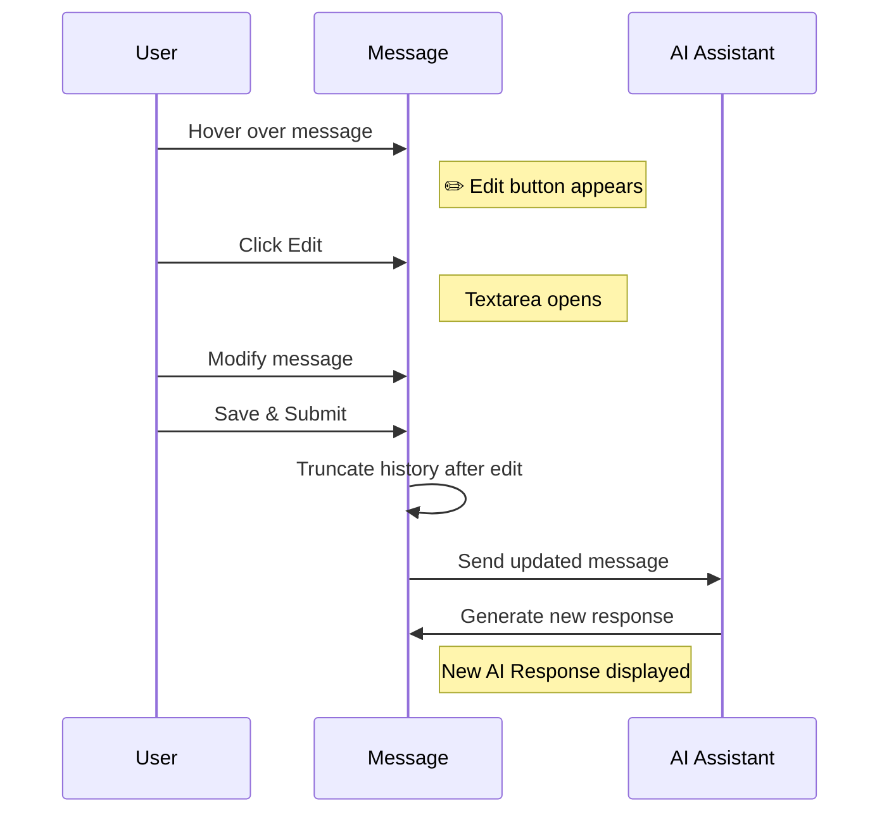
```mermaid
sequenceDiagram
    participant U as User
    participant M as Message
    participant AI as AI Assistant
    U->>M: Hover over message
    Note right of M: ✏️ Edit button appears
    U->>M: Click Edit
    Note right of M: Textarea opens
    U->>M: Modify message
    U->>M: Save & Submit
    M->>M: Truncate history after edit
    M->>AI: Send updated message
    AI->>M: Generate new response
    Note right of M: New AI Response displayed
```
| Step | Action | Description |
|------|--------|-------------|
| 1 | **Hover** | Edit button (✏️) appears on user message |
| 2 | **Click Edit** | Textarea opens for editing |
| 3 | **Submit** | History truncated, AI regenerates response |

| Feature | Description |
|---------|-------------|
| **Edit Button** | Appears on hover over user messages |
| **Inline Editing** | Textarea replaces message text |
| **History Truncation** | Removes all messages after edited one |
| **Auto-Regenerate** | AI generates fresh response |
| **Keyboard Support** | `Enter` = save, `Escape` = cancel |

---

### 4. Generation Controls
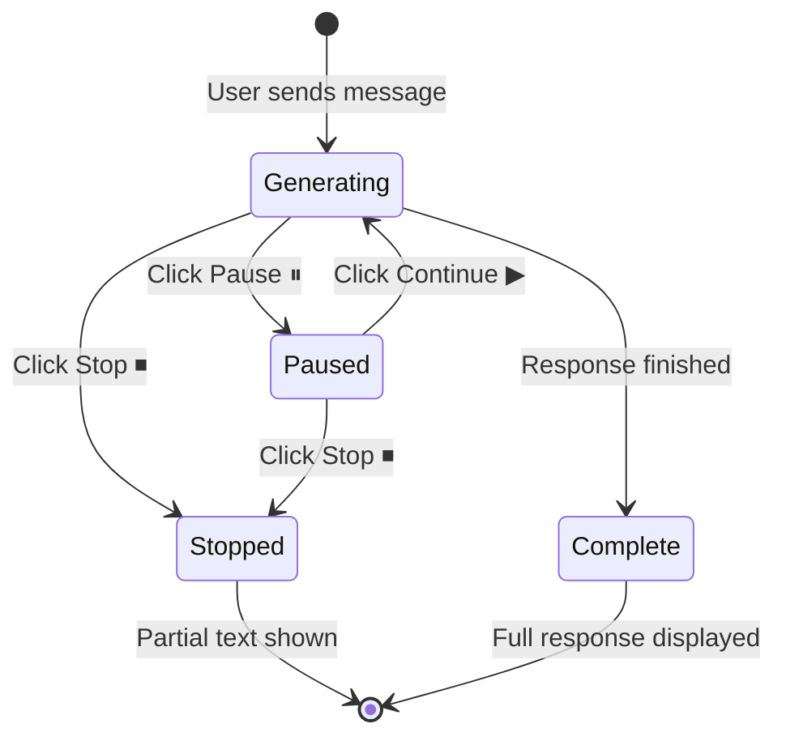
```mermaid
stateDiagram-v2
    [*] --> Generating: User sends message
    Generating --> Paused: Click Pause ⏸
    Generating --> Stopped: Click Stop ⏹
    Paused --> Generating: Click Continue ▶
    Paused --> Stopped: Click Stop ⏹
    Generating --> Complete: Response finished
    Stopped --> [*]: Partial text shown
    Complete --> [*]: Full response displayed
```
| State | Controls Available | Cursor |
|-------|-------------------|--------|
| **During Generation** | `[⏸ Pause]` `[⏹ Stop]` | `▌` (animated) |
| **When Paused** | `[▶ Continue]` `[⏹ Stop]` | `⏸` (paused) |
| **When Stopped** | Generation stopped message | None |

#### State Variables
| Variable | Type | Description |
|----------|------|-------------|
| `isGenerating` | `boolean` | Currently generating response |
| `isPaused` | `boolean` | Generation is paused |
| `isStopped` | `boolean` | Generation was stopped |

---

### 5. Typewriter Effect
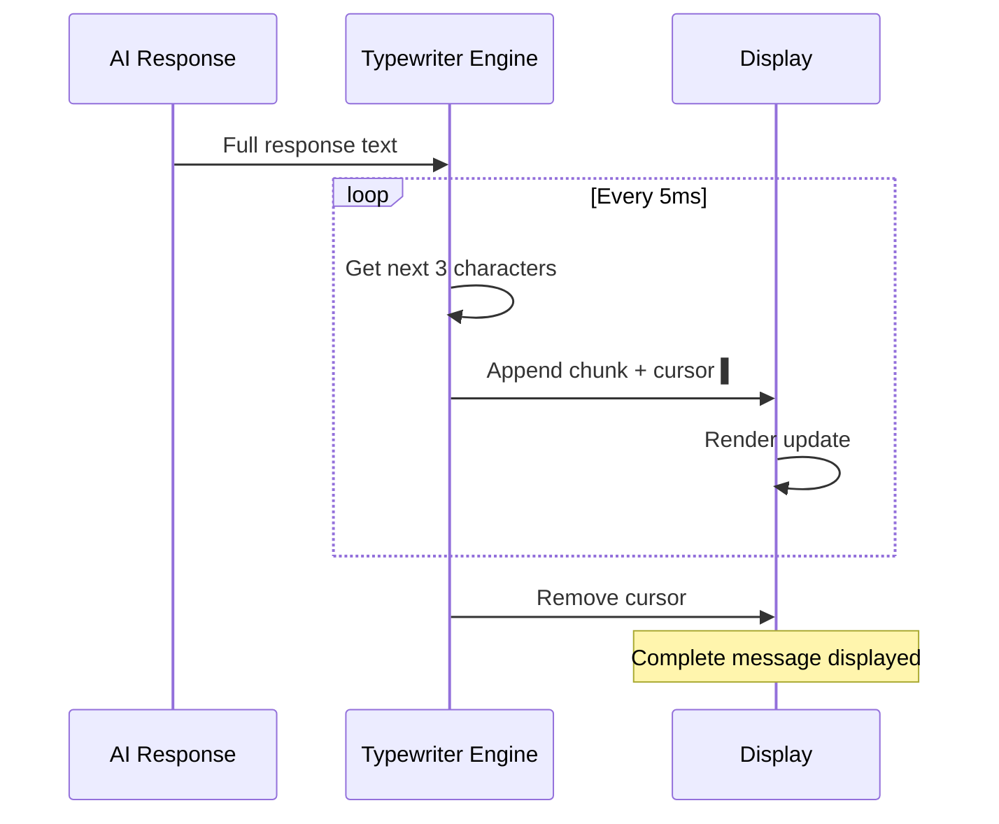
```mermaid
sequenceDiagram
    participant AI as AI Response
    participant TE as Typewriter Engine
    participant UI as Display
    AI->>TE: Full response text
    loop Every 5ms
        TE->>TE: Get next 3 characters
        TE->>UI: Append chunk + cursor ▌
        UI->>UI: Render update
    end
    TE->>UI: Remove cursor
    Note over UI: Complete message displayed
```
| Parameter | Value |
|-----------|-------|
| **Speed** | 5ms per character |
| **Chunk Size** | 3 characters per update |
| **Cursor** | `▌` (animated) |
| **Pause Cursor** | `⏸` |

---

### 6. Markdown Rendering
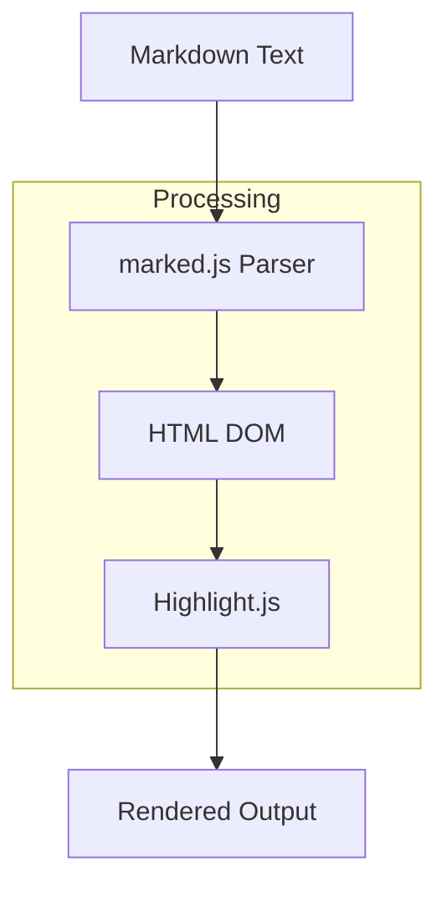
```mermaid
flowchart TD
    A[Markdown Text] --> B[marked.js Parser]
    B --> C[HTML DOM]
    C --> D[Highlight.js]
    D --> E[Rendered Output]
    subgraph Processing
        B
        C
        D
    end
```
#### Supported Elements
| Element | Syntax |
|---------|--------|
| Headers | `# H1` to `###### H6` |
| Bold | `**bold**` |
| Italic | `*italic*` |
| Strikethrough | `~~strike~~` |
| Lists | `-` or `1.` |
| Code | `` `inline` `` or ` ``` block ``` ` |
| Links | `[text](url)` |
| Images | `` |
| Tables | `| col1 | col2 |` |
| Blockquotes | `> quote` |

---

### 7. Syntax Highlighting
#### Supported Languages
| Category | Languages |
|----------|-----------|
| **Web** | HTML, CSS, JavaScript, TypeScript |
| **Backend** | Python, Java, PHP, Ruby |
| **Systems** | C++, Go, Rust |
| **Data** | SQL, JSON, YAML |
| **Shell** | Bash, Markdown |

---

## Frontend Code Execution
### Live Preview Feature
LAPLACIAN can execute HTML, CSS, and JavaScript code directly in a sandboxed iframe preview.

### Supported Languages
| Language | Execution Type | Description |
|----------|---------------|-------------|
| `html` | Full document | Complete HTML documents or fragments |
| `css` | Demo wrapped | Styles applied to demo elements |
| `javascript` / `js` | Console capture | Output captured and displayed |
| `jsx` / `tsx` | Detected | React/TypeScript components |
| `vue` / `svelte` | Basic | Basic framework rendering |

### Code Block with Run Button
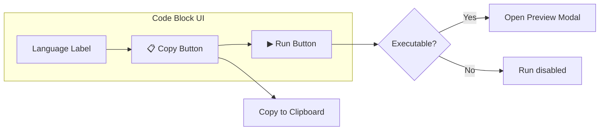
```mermaid
flowchart LR
    subgraph CodeBlock["Code Block UI"]
        A["Language Label"] --> B["📋 Copy Button"]
        B --> C["▶ Run Button"]
    end
    C --> D{Executable?}
    D -->|Yes| E[Open Preview Modal]
    D -->|No| F[Run disabled]
    B --> G[Copy to Clipboard]
```
| Button | Action |
|--------|--------|
| **📋 Copy** | Copy code to clipboard |
| **▶ Run** | Execute in preview modal |

#### Detection
```javascript
isExecutableCode(lang, content) {
  const executable = [
    'html', 'css',
    'javascript', 'js',
    'jsx', 'tsx',
    'vue', 'svelte'
  ];
  return executable.includes(lang);
}
```

### Preview Modal Features
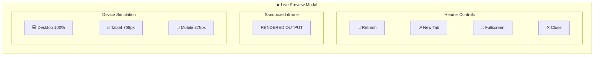
```mermaid
flowchart TB
    subgraph Modal["▶ Live Preview Modal"]
        direction TB
        subgraph Header["Header Controls"]
            R["🔄 Refresh"] --- N["↗️ New Tab"] --- F["⛶ Fullscreen"] --- X["✕ Close"]
        end
        subgraph Content["Sandboxed iframe"]
            O[RENDERED OUTPUT]
        end
        subgraph Footer["Device Simulation"]
            D["💻 Desktop 100%"] --- T["📱 Tablet 768px"] --- M["📱 Mobile 375px"]
        end
    end
```
| Button | Function |
|--------|----------|
| 🔄 | Refresh/Reload iframe |
| ↗️ | Open in new tab |
| ⛶ | Toggle fullscreen |
| ✕ | Close modal |

| Mode | Width | Icon |
|------|-------|------|
| Desktop | 100% | 💻 |
| Tablet | 768px | 📱 |
| Mobile | 375px | 📱 |

---

### JavaScript Console Capture
| Method | Color | Example |
|--------|-------|---------|
| `console.log()` | Blue | `console.log("Hello");` |
| `console.error()` | Red | `console.error("Error!");` |
| `console.warn()` | Yellow | `console.warn("Warning");` |
| `console.info()` | Blue | `console.info("Info");` |

---

## Mermaid Diagram Rendering
### Auto-Detection
LAPLACIAN automatically detects and renders Mermaid diagrams in code blocks.

### Supported Diagram Types
| Category | Types | Example Syntax |
|----------|-------|----------------|
| **Flow** | `flowchart`, `graph` | `graph LR A --> B --> C` |
| **Sequence** | `sequenceDiagram` | `A ->> B: Message` |
| **Class** | `classDiagram` | `class Animal { +name }` |
| **State** | `stateDiagram-v2` | `[*] --> Active` |
| **Entity** | `erDiagram` | `USER \|\|--o{ ORDER` |
| **Gantt** | `gantt` | `Task 1: a1, 2024-01-01, 7d` |
| **Pie** | `pie` | `"A": 30, "B": 70` |
| **Other** | `gitGraph`, `journey`, `mindmap`, `timeline`, `C4` | Various syntaxes |

---

### Diagram Block UI
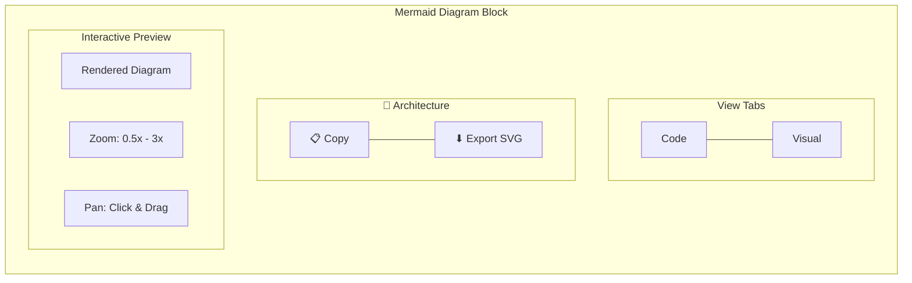
```mermaid
flowchart TB
    subgraph DiagramUI["Mermaid Diagram Block"]
        direction TB
        subgraph Tabs["View Tabs"]
            C["Code"] --- V["Visual"]
        end
        subgraph Controls["📐 Architecture"]
            CP["📋 Copy"] --- EX["⬇ Export SVG"]
        end
        subgraph Preview["Interactive Preview"]
            DG["Rendered Diagram"]
            Z["Zoom: 0.5x - 3x"]
            P["Pan: Click & Drag"]
        end
    end
```
| Feature | Description |
|---------|-------------|
| **Tab: Code** | View source code |
| **Tab: Visual** | View rendered diagram |
| **📋 Copy** | Copy source code |
| **⬇ Export** | Download as SVG |
| **Zoom** | Mouse wheel (0.5x - 3x) |
| **Pan** | Click and drag |
| **Fullscreen** | Expand view |

---

## DocIQ - Document Intelligence
### RAG (Retrieval Augmented Generation)
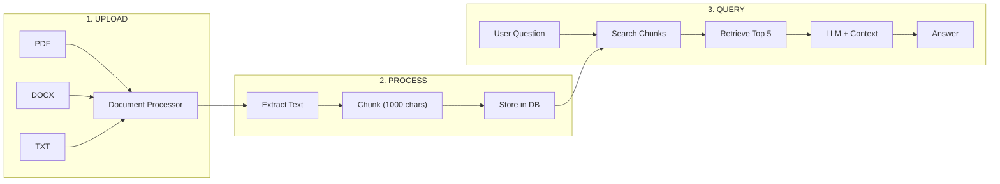
```mermaid
flowchart LR
    subgraph Upload["1. UPLOAD"]
        A[PDF] --> D[Document Processor]
        B[DOCX] --> D
        C[TXT] --> D
    end
    subgraph Process["2. PROCESS"]
        D --> E[Extract Text]
        E --> F["Chunk (1000 chars)"]
        F --> G[Store in DB]
    end
    subgraph Query["3. QUERY"]
        H[User Question] --> I[Search Chunks]
        I --> J[Retrieve Top 5]
        J --> K[LLM + Context]
        K --> L[Answer]
    end
    G --> I
```
### Configuration
| Parameter | Value | Description |
|-----------|-------|-------------|
| **Max File Size** | 16 MB | Maximum upload size |
| **Chunk Size** | 1000 chars | Text split size |
| **Chunk Overlap** | 200 chars | Overlap between chunks |
| **Top K Results** | 5 chunks | Retrieved for context |

### Supported Formats
| Format | Library | Features |
|--------|---------|----------|
| **PDF** | PyPDF2 | Text extraction from pages |
| **DOCX** | python-docx | Paragraph extraction |
| **TXT** | Built-in | UTF-8/Latin-1 encoding |

---

## VizIQ - Data Visualization
### Auto-Dashboard Generation
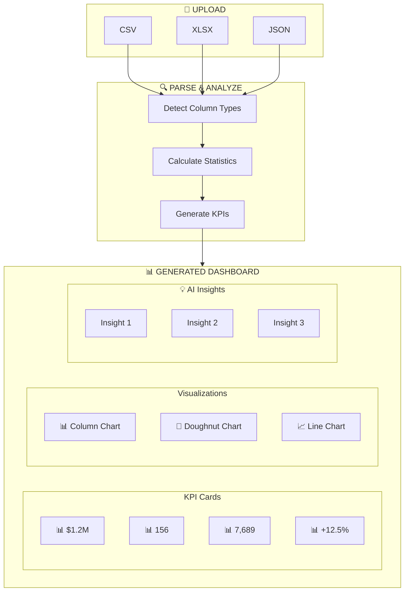
```mermaid
flowchart TD
    subgraph Input["📁 UPLOAD"]
        A[CSV]
        B[XLSX]
        C[JSON]
    end
    subgraph Processing["🔍 PARSE & ANALYZE"]
        D[Detect Column Types]
        E[Calculate Statistics]
        F[Generate KPIs]
    end
    subgraph Dashboard["📊 GENERATED DASHBOARD"]
        subgraph KPIs["KPI Cards"]
            K1["📊 $1.2M"]
            K2["📊 156"]
            K3["📊 7,689"]
            K4["📊 +12.5%"]
        end
        subgraph Charts["Visualizations"]
            CH1["📊 Column Chart"]
            CH2["🍩 Doughnut Chart"]
            CH3["📈 Line Chart"]
        end
        subgraph Insights["💡 AI Insights"]
            I1["Insight 1"]
            I2["Insight 2"]
            I3["Insight 3"]
        end
    end
    A --> D
    B --> D
    C --> D
    D --> E --> F --> Dashboard
```
### Generated Components
| Component | Icon | Description |
|-----------|------|-------------|
| **KPI Cards** | 📊 | Auto-calculated key metrics |
| **Column Chart** | 📊 | Categorical vs numeric data |
| **Doughnut Chart** | 🍩 | Distribution breakdown |
| **Line Chart** | 📈 | Trend analysis over time |
| **Comparison Chart** | 📉 | Multi-metric comparison |
| **AI Insights** | 💡 | Pattern detection alerts |
| **Data Table** | 📋 | First 100 rows preview |

### Column Type Detection
| Type | Detection Rule | Example |
|------|---------------|---------|
| `numeric` | 70%+ values are numbers | `123`, `45.67` |
| `date` | Contains date separators | `2024-01-15`, `01/15/24` |
| `categorical` | Everything else | `Red`, `Blue`, `Active` |

---

## Productivity Suite
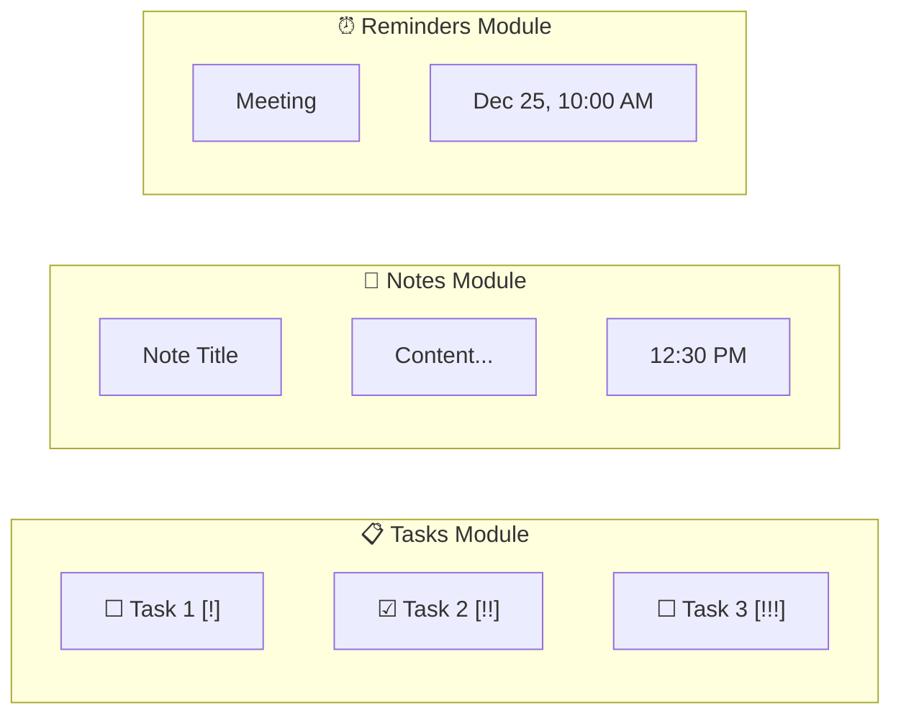
```mermaid
flowchart LR
    subgraph Tasks["📋 Tasks Module"]
        T1["☐ Task 1 [!]"]
        T2["☑ Task 2 [!!]"]
        T3["☐ Task 3 [!!!]"]
    end
    subgraph Notes["📝 Notes Module"]
        N1["Note Title"]
        N2["Content..."]
        N3["12:30 PM"]
    end
    subgraph Reminders["⏰ Reminders Module"]
        R1["Meeting"]
        R2["Dec 25, 10:00 AM"]
    end
```
| Module | Features |
|--------|----------|
| **Tasks** | Create, Priority (High/Medium/Low), Status (Pending/Done), Filter, Delete |
| **Notes** | Create (Title + Content), Card Display, Auto-Timestamp, Delete |
| **Reminders** | Create (Date/Time), Alert Notifications, Delete |

---

## System Architecture
### LAPLACIAN Architecture *by Perfionix AI*
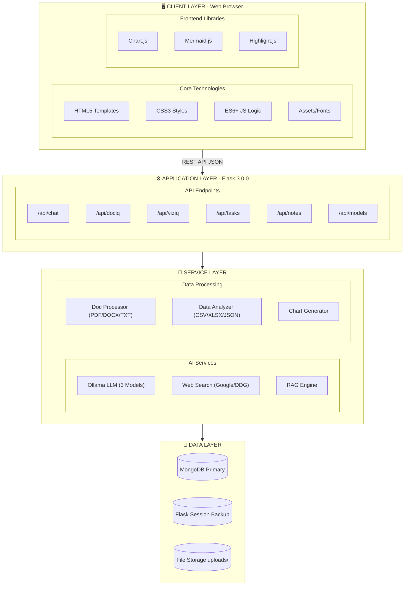
```mermaid
flowchart TB
    subgraph Client["🖥️ CLIENT LAYER - Web Browser"]
        direction LR
        subgraph Core["Core Technologies"]
            H[HTML5 Templates]
            C[CSS3 Styles]
            J[ES6+ JS Logic]
            A[Assets/Fonts]
        end
        subgraph Libraries["Frontend Libraries"]
            CH[Chart.js]
            ME[Mermaid.js]
            HL[Highlight.js]
        end
    end
    subgraph Application["⚙️ APPLICATION LAYER - Flask 3.0.0"]
        direction LR
        subgraph APIs["API Endpoints"]
            CA["/api/chat"]
            DA["/api/dociq"]
            VA["/api/viziq"]
            TA["/api/tasks"]
            NA["/api/notes"]
            MA["/api/models"]
        end
    end
    subgraph Service["🔧 SERVICE LAYER"]
        direction LR
        subgraph AI["AI Services"]
            OL["Ollama LLM (3 Models)"]
            WS["Web Search (Google/DDG)"]
            RAG["RAG Engine"]
        end
        subgraph Processing["Data Processing"]
            DP["Doc Processor (PDF/DOCX/TXT)"]
            DAN["Data Analyzer (CSV/XLSX/JSON)"]
            CG["Chart Generator"]
        end
    end
    subgraph Data["💾 DATA LAYER"]
        direction LR
        MO[(MongoDB Primary)]
        FS[(Flask Session Backup)]
        UP[(File Storage uploads/)]
    end
    Client -->|REST API JSON| Application
    Application --> Service
    Service --> Data
```

---

## Chat System Flow Diagram
### Complete Chat Pipeline - LAPLACIAN CHAT SYSTEM *by Perfionix AI*
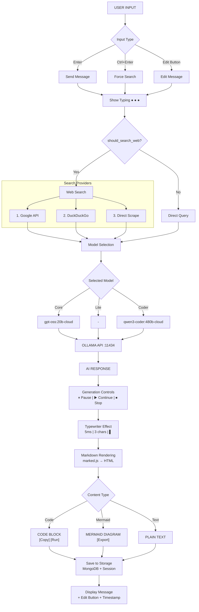
```mermaid
flowchart TD
    A[USER INPUT] --> B{Input Type}
    B -->|Enter| C[Send Message]
    B -->|Ctrl+Enter| D[Force Search]
    B -->|Edit Button| E[Edit Message]
    C --> F["Show Typing ● ● ●"]
    D --> F
    E --> F
    F --> G{should_search_web?}
    G -->|Yes| H[Web Search]
    G -->|No| I[Direct Query]
    subgraph Search["Search Providers"]
        H --> H1[1. Google API]
        H --> H2[2. DuckDuckGo]
        H --> H3[3. Direct Scrape]
    end
    H1 --> J
    H2 --> J
    H3 --> J
    I --> J
    J[Model Selection] --> K{Selected Model}
    K -->|Core| L["gpt-oss:20b-cloud"]
    K -->|Lite| M["-"]
    K -->|Coder| N["qwen3-coder:480b-cloud"]
    L --> O["OLLAMA API :11434"]
    M --> O
    N --> O
    O --> P[AI RESPONSE]
    P --> Q["Generation Controls<br/>⏸ Pause | ▶ Continue | ⏹ Stop"]
    Q --> R["Typewriter Effect<br/>5ms | 3 chars | ▌"]
    R --> S["Markdown Rendering<br/>marked.js → HTML"]
    S --> T{Content Type}
    T -->|Code| U["CODE BLOCK<br/>[Copy] [Run]"]
    T -->|Mermaid| V["MERMAID DIAGRAM<br/>[Export]"]
    T -->|Text| W[PLAIN TEXT]
    U --> X["Save to Storage<br/>MongoDB + Session"]
    V --> X
    W --> X
    X --> Y["Display Message<br/>+ Edit Button + Timestamp"]
```

### State Machine
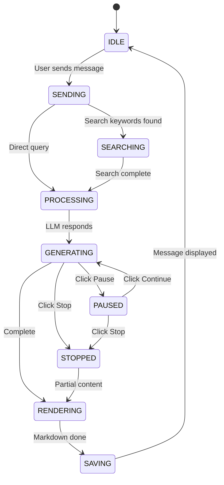
```mermaid
stateDiagram-v2
    [*] --> IDLE
    IDLE --> SENDING: User sends message
    SENDING --> SEARCHING: Search keywords found
    SENDING --> PROCESSING: Direct query
    SEARCHING --> PROCESSING: Search complete
    PROCESSING --> GENERATING: LLM responds
    GENERATING --> PAUSED: Click Pause
    GENERATING --> STOPPED: Click Stop
    GENERATING --> RENDERING: Complete
    PAUSED --> GENERATING: Click Continue
    PAUSED --> STOPPED: Click Stop
    STOPPED --> RENDERING: Partial content
    RENDERING --> SAVING: Markdown done
    SAVING --> IDLE: Message displayed
```
#### State Transitions
| From | To | Trigger |
|------|----|---------|
| IDLE | SENDING | User sends message |
| SENDING | SEARCHING | Search keywords found |
| SENDING | PROCESSING | Direct query |
| SEARCHING | PROCESSING | Search complete |
| PROCESSING | GENERATING | LLM responds |
| GENERATING | PAUSED | User clicks Pause |
| GENERATING | STOPPED | User clicks Stop |
| PAUSED | GENERATING | User clicks Continue |
| PAUSED | STOPPED | User clicks Stop |
| GENERATING | RENDERING | Complete |
| STOPPED | RENDERING | Partial content |
| RENDERING | SAVING | Markdown done |
| SAVING | IDLE | Message displayed |

---

## Tech Stack
### Backend
| Technology | Version | Purpose |
|------------|---------|---------|
| **Python** | 3.8+ | Core Language |
| **Flask** | 3.0.0 | Web Framework |
| **pymongo** | 4.6.1 | MongoDB Driver |
| **PyPDF2** | 3.0.1 | PDF Processing |
| **python-docx** | 1.1.0 | Word Documents |
| **openpyxl** | 3.1.2 | Excel Files |
| **BeautifulSoup4** | 4.12.2 | Web Scraping |
| **requests** | 2.31.0 | HTTP Client |

### Frontend
| Technology | Version | Purpose |
|------------|---------|---------|
| **HTML5** | - | Structure |
| **CSS3** | - | Glassmorphism Dark Theme |
| **JavaScript** | ES6+ | Interactivity |
| **Chart.js** | Latest | Data Visualization |
| **Mermaid.js** | 10.6.1 | Diagram Rendering |
| **Highlight.js** | 11.9.0 | Syntax Highlighting |
| **Marked.js** | Latest | Markdown Parsing |

### External Services
| Service | Purpose |
|---------|---------|
| **Ollama** | Local LLM Inference |
| **MongoDB** | Persistent Storage |
| **Google/DuckDuckGo** | Web Search |
| **ElevenLabs** | Text-to-Speech (Optional) |

---

## API Reference
### Chat Endpoints
| Endpoint | Method | Description |
|----------|--------|-------------|
| `/api/chat` | POST | Send message to AI |
| `/api/chat/edit` | POST | Edit message and regenerate |
| `/api/chat/reset` | POST | Clear conversation |
| `/api/chat/debug` | GET | Debug conversation state |
| `/api/models` | GET | List available AI models |
| `/api/models/select` | POST | Switch AI model |
| `/api/search` | POST | Web search with summary |
| `/api/speech` | POST | Text-to-speech |

### DocIQ Endpoints
| Endpoint | Method | Description |
|----------|--------|-------------|
| `/api/dociq/upload` | POST | Upload document |
| `/api/dociq/documents` | GET | List uploaded documents |
| `/api/dociq/documents/<id>` | DELETE | Delete document |
| `/api/dociq/chat` | POST | Query documents |
| `/api/dociq/summary` | GET | Get document summary |
| `/api/dociq/clear` | POST | Clear all documents |

### VizIQ Endpoints
| Endpoint | Method | Description |
|----------|--------|-------------|
| `/api/viziq/upload` | POST | Upload data file |
| `/api/viziq/data` | GET | Get current data |
| `/api/viziq/clear` | POST | Clear data |

### Productivity Endpoints
| Endpoint | Method | Description |
|----------|--------|-------------|
| `/api/tasks` | GET/POST | List/Create tasks |
| `/api/tasks/<id>` | PUT/DELETE | Update/Delete task |
| `/api/notes` | GET/POST | List/Create notes |
| `/api/notes/<id>` | DELETE | Delete note |
| `/api/reminders` | GET/POST | List/Create reminders |
| `/api/reminders/<id>` | DELETE | Delete reminder |
| `/api/stats` | GET | Get user statistics |

---

## Installation Guide
### Prerequisites
- Python 3.8+
- MongoDB (optional, recommended)
- Ollama with models installed
- Modern web browser

### Quick Start

```bash
# 1. Clone repository
git clone https://github.com/TR0J49/laplacian-ai.git
cd laplacian

# 2. Create virtual environment
python -m venv venv

# Windows
venv\Scripts\activate

# Linux/Mac
source venv/bin/activate

# 3. Install dependencies
pip install -r requirements.txt

# 4. Configure environment
cp .env.example .env
# Edit .env with your settings

# 5. Start Ollama and pull models
ollama serve
ollama pull phi3:mini
ollama pull qwen3-coder

# 6. Run application
python app.py

# 7. Access Laplacian
# Open http://localhost:5000
```

---

## Future Roadmap
### Version 2.1 (Q1 2025)
- [ ] Voice input with speech recognition
- [ ] Multi-language interface support
- [ ] Advanced RAG with embeddings
- [ ] Export chat history as PDF
- [ ] Code execution for Python (sandboxed)

### Version 2.2 (Q2 2025)
- [ ] User authentication system
- [ ] Team collaboration features
- [ ] Custom model fine-tuning
- [ ] API rate limiting
- [ ] Webhook integrations

### Version 3.0 (Q3 2025)
- [ ] Mobile responsive PWA
- [ ] Plugin architecture
- [ ] Real-time collaboration
- [ ] Enterprise SSO integration
- [ ] Self-hosted deployment guide

---

## Contact & Support
| | |
|---|---|
| **Company** | Perfionix AI Technology Pvt Ltd |
| **Product** | LAPLACIAN v2.0 |
| **Founder** | Shubham Rahangdale |
| **Email** | connect@perfionixai.com |

**Technical Support:** connect@perfionixai.com
**Subject Format:** `[LAPLACIAN] <Issue Type> - <Brief Description>`

---

<p align="center">
  
</p>

<p align="center">
  <strong>LAPLACIAN v2.0</strong><br>
  <em>AI Code Assistant & Productivity Platform</em>
</p>

<p align="center">
  <strong>Perfionix AI Technology Pvt Ltd</strong><br>
  
</p>

<p align="center">
  <em>"Empowering developers with intelligent AI"</em>
</p>

---

<p align="center">
  <sub>Copyright 2024 Perfionix AI Technology Pvt Ltd. All rights reserved.</sub>
</p>

---

**Document Version:** 2.0.0
**Last Updated:** December 2025
**Status:** Production Ready
**Classification:** Public Documentation
