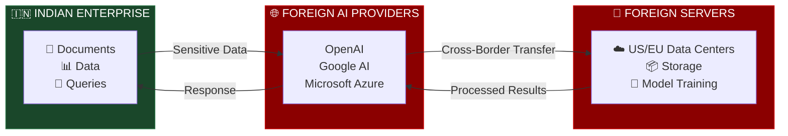
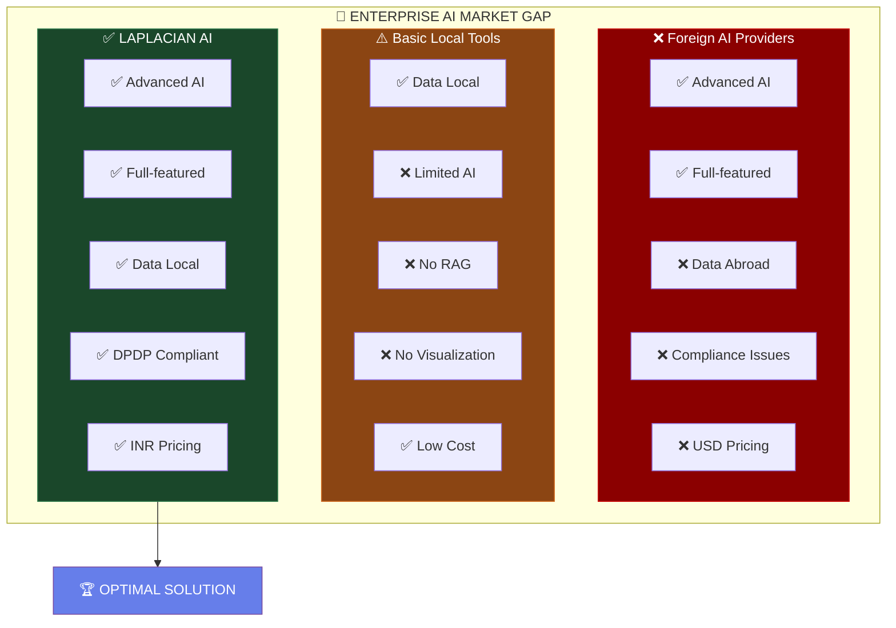
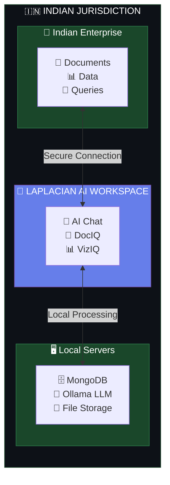
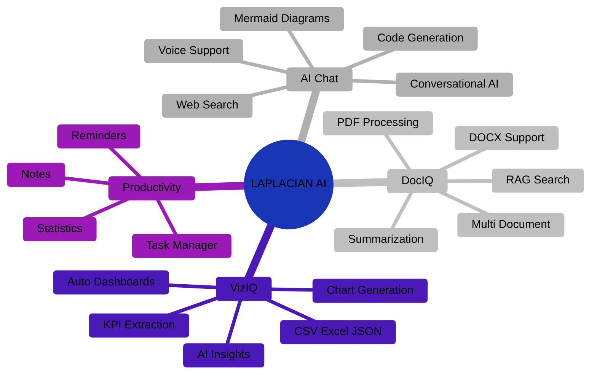
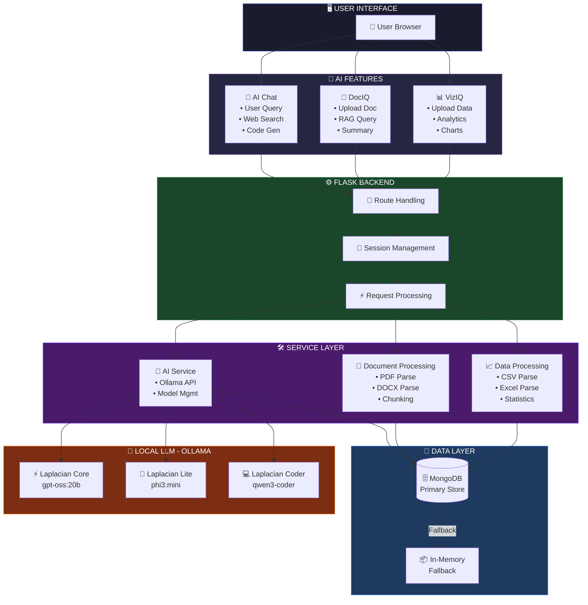
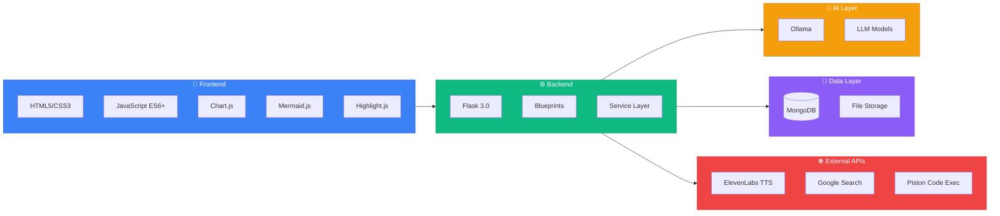
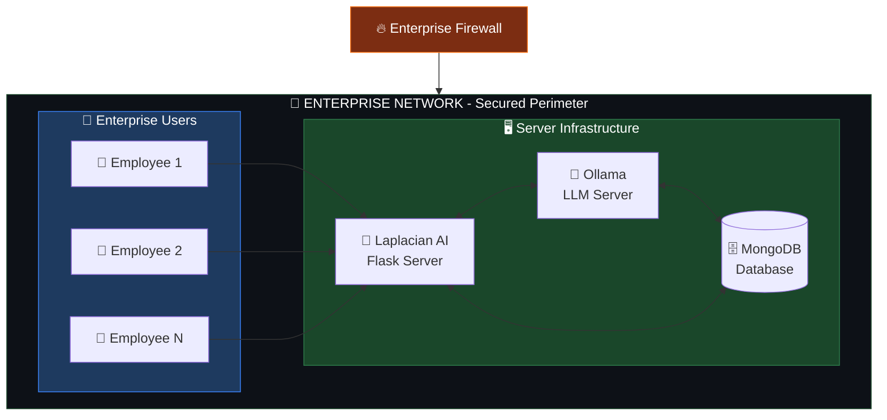
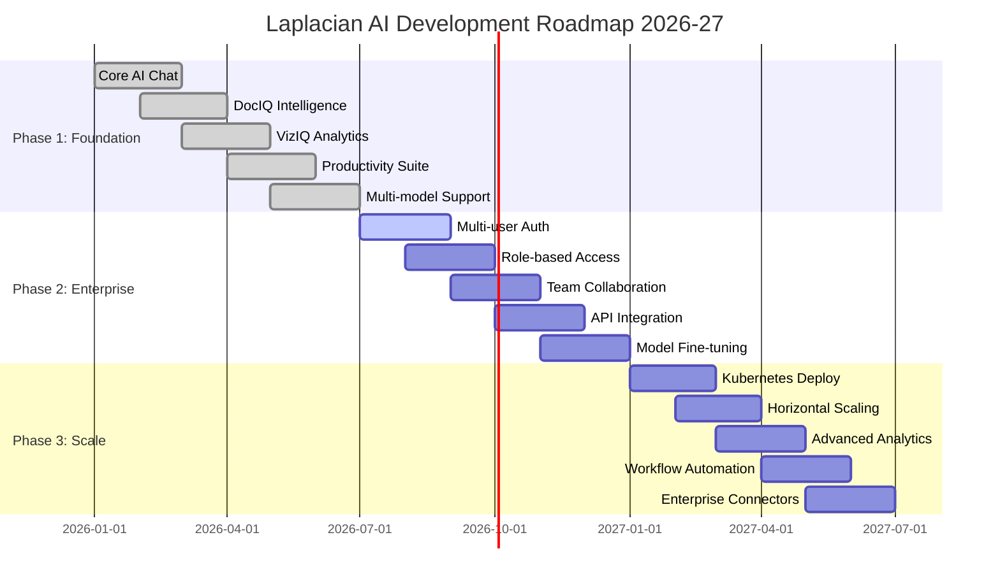

<p align="center">
  
</p>

<h1 align="center">LAPLACIAN AI</h1>
<h3 align="center">India's First AI Workspace for Secure Enterprise Intelligence</h3>

<p align="center">
  <strong>Empowering Indian Enterprises with Sovereign AI Solutions</strong>
</p>

<p align="center">
  <a href="https://www.perfionixai.com">
    
  </a>
  
  
  
</p>

<p align="center">
  <a href="#abstract">Abstract</a> •
  <a href="#introduction">Introduction</a> •
  <a href="#problem-statement">Problem</a> •
  <a href="#solution">Solution</a> •
  <a href="#features">Features</a> •
  <a href="#technology-stack">Tech Stack</a> •
  <a href="#installation">Installation</a>
</p>

---

## Company Information

| | |
|---|---|
| **Organization** | Perfionix AI Technology Pvt Ltd |
| **Product** | Laplacian AI - Enterprise AI Workspace |
| **Version** | 1.0 |
| **Founder & CEO** | Shubham Rahangdale |
| **Headquarters** | India |
| **Website** | [www.perfionixai.com](https://www.perfionixai.com) |
| **Contact** | connect@perfionixai.com |
| **Industry** | Artificial Intelligence / Enterprise Software |

---

## Abstract

**Laplacian AI** is India's pioneering AI Workspace platform, designed to address the critical need for data sovereignty and secure artificial intelligence solutions in the Indian enterprise ecosystem. As organizations increasingly rely on AI-powered tools for document analysis, data visualization, and intelligent automation, concerns about data privacy, cross-border data transfer, and dependency on foreign AI infrastructure have become paramount.

Laplacian AI provides a comprehensive, locally-deployable AI workspace that combines **conversational AI**, **document intelligence (DocIQ)**, and **data visualization (VizIQ)** capabilities—all while ensuring that sensitive enterprise data never leaves Indian jurisdiction. Built on open-source foundation models and designed for on-premise deployment, Laplacian AI represents a strategic shift towards technological self-reliance in India's digital transformation journey.

---

## Introduction

### The AI Revolution and India's Opportunity

The global artificial intelligence market is projected to reach **$1.8 trillion by 2030**, with enterprise AI applications driving significant productivity gains across industries. India, with its vast talent pool and rapidly digitizing economy, stands at a pivotal moment in this technological revolution.

However, the current landscape presents a critical challenge: **over 90% of enterprise AI tools used by Indian organizations** route sensitive data through servers located in the United States, European Union, and other foreign jurisdictions. This dependency creates risks related to:

- Data privacy and sovereignty
- Regulatory compliance (IT Act, DPDP Act 2023)
- Intellectual property protection
- Business continuity and geopolitical stability

### Vision

> *"To establish India as a global leader in sovereign AI infrastructure, enabling enterprises to harness artificial intelligence without compromising data security or national interests."*

### Mission

Laplacian AI is committed to:

1. **Data Sovereignty** - Ensuring Indian data remains within Indian borders
2. **Enterprise Empowerment** - Providing world-class AI tools accessible to all organizations
3. **Technological Independence** - Reducing dependency on foreign AI infrastructure
4. **Innovation Excellence** - Continuously advancing AI capabilities for Indian enterprises

---

## Problem Statement

### The Data Sovereignty Crisis in Indian Enterprises


```mermaid
flowchart LR
    subgraph INDIA["🇮🇳 INDIAN ENTERPRISE"]
        A["📄 Documents<br/>📊 Data<br/>💬 Queries"]
    end

    subgraph FOREIGN["🌐 FOREIGN AI PROVIDERS"]
        B["OpenAI<br/>Google AI<br/>Microsoft Azure"]
    end

    subgraph SERVERS["🏢 FOREIGN SERVERS"]
        C["☁️ US/EU Data Centers<br/>📦 Storage<br/>🧠 Model Training"]
    end

    A -->|"Sensitive Data"| B
    B -->|"Cross-Border Transfer"| C
    C -->|"Processed Results"| B
    B -->|"Response"| A

    style INDIA fill:#1a472a,stroke:#2d7a4a,color:#fff
    style FOREIGN fill:#8b0000,stroke:#cc0000,color:#fff
    style SERVERS fill:#8b0000,stroke:#cc0000,color:#fff
```

> ⚠️ **RISK:** Sensitive Indian enterprise data processed and stored on foreign soil

### Key Challenges Facing Indian Enterprises

| Challenge | Impact | Scale |
|-----------|--------|-------|
| **Data Privacy Violations** | Sensitive corporate data exposed to foreign entities | 78% of Indian enterprises use foreign AI tools |
| **Regulatory Non-Compliance** | Violation of IT Act 2000, DPDP Act 2023 | ₹250 Cr penalty provisions under DPDP |
| **Intellectual Property Risk** | Training data potentially used by foreign AI | Affects 65% of R&D-intensive organizations |
| **Latency Issues** | Degraded performance due to cross-border routing | 200-500ms additional latency |
| **Cost Escalation** | Dollar-denominated pricing affecting budgets | 15-30% YoY cost increase |
| **Service Continuity** | Dependency on foreign policy decisions | Single point of failure |

### Regulatory Landscape

**Digital Personal Data Protection Act, 2023 (DPDP)**

- Mandates explicit consent for data processing
- Restricts cross-border data transfer to notified countries
- Imposes penalties up to ₹250 crore for violations
- Requires Data Protection Impact Assessments

**IT Act 2000 & Amendments**

- Section 43A: Compensation for failure to protect data
- Section 72A: Punishment for disclosure of information
- Intermediary guidelines requiring data localization

### Market Gap Analysis


```mermaid
flowchart TB
    subgraph MARKET["🎯 ENTERPRISE AI MARKET GAP"]
        direction TB

        subgraph FOREIGN["❌ Foreign AI Providers"]
            F1["✅ Advanced AI"]
            F2["✅ Full-featured"]
            F3["❌ Data Abroad"]
            F4["❌ Compliance Issues"]
            F5["❌ USD Pricing"]
        end

        subgraph LOCAL["⚠️ Basic Local Tools"]
            L1["✅ Data Local"]
            L2["❌ Limited AI"]
            L3["❌ No RAG"]
            L4["❌ No Visualization"]
            L5["✅ Low Cost"]
        end

        subgraph LAPLACIAN["✅ LAPLACIAN AI"]
            P1["✅ Advanced AI"]
            P2["✅ Full-featured"]
            P3["✅ Data Local"]
            P4["✅ DPDP Compliant"]
            P5["✅ INR Pricing"]
        end
    end

    LAPLACIAN --> OPTIMAL["🏆 OPTIMAL SOLUTION"]

    style FOREIGN fill:#8b0000,stroke:#cc0000,color:#fff
    style LOCAL fill:#8b4513,stroke:#d2691e,color:#fff
    style LAPLACIAN fill:#1a472a,stroke:#2d7a4a,color:#fff
    style OPTIMAL fill:#667eea,stroke:#764ba2,color:#fff
```

---

## Solution

### Laplacian AI: The Sovereign AI Workspace

Laplacian AI addresses these challenges through a comprehensive, locally-deployable AI workspace that delivers enterprise-grade capabilities while ensuring complete data sovereignty.


```mermaid
flowchart LR
    subgraph INDIA["🇮🇳 INDIAN JURISDICTION"]
        subgraph ENTERPRISE["🏢 Indian Enterprise"]
            A["📄 Documents<br/>📊 Data<br/>💬 Queries"]
        end

        subgraph LAPLACIAN["🚀 LAPLACIAN AI WORKSPACE"]
            B["💬 AI Chat<br/>📄 DocIQ<br/>📊 VizIQ"]
        end

        subgraph LOCAL["🖥️ Local Servers"]
            C["🗄️ MongoDB<br/>🤖 Ollama LLM<br/>📁 File Storage"]
        end

        A <-->|"Secure Connection"| B
        B <-->|"Local Processing"| C
    end

    style INDIA fill:#0d1117,stroke:#1a472a,color:#fff
    style ENTERPRISE fill:#1a472a,stroke:#2d7a4a,color:#fff
    style LAPLACIAN fill:#667eea,stroke:#764ba2,color:#fff
    style LOCAL fill:#1a472a,stroke:#2d7a4a,color:#fff
```

> ✅ **SECURE:** All data processed and stored within Indian jurisdiction

### Core Value Propositions

| Proposition | Description | Benefit |
|-------------|-------------|---------|
| **100% Data Sovereignty** | All processing occurs on local/Indian infrastructure | Full DPDP compliance |
| **Enterprise-Grade AI** | Advanced LLM capabilities via Ollama | No compromise on quality |
| **Unified Workspace** | Chat + Documents + Data in one platform | Improved productivity |
| **On-Premise Deployment** | Deploy on your own servers | Complete control |
| **Cost Efficiency** | INR-based, predictable pricing | 40-60% cost reduction |
| **Customizable Models** | Choose and fine-tune your AI models | Domain-specific excellence |

---

## Features

Laplacian AI provides a comprehensive AI workspace with three core intelligence modules and productivity tools:


```mermaid
%%{init: {'theme': 'base', 'themeVariables': { 'primaryColor': '#667eea', 'primaryTextColor': '#000000', 'primaryBorderColor': '#764ba2', 'lineColor': '#333333', 'secondaryColor': '#f0f0f0', 'tertiaryColor': '#ffffff'}}}%%
mindmap
  root((LAPLACIAN AI))
    AI Chat
      Conversational AI
      Web Search
      Code Generation
      Mermaid Diagrams
      Voice Support
    DocIQ
      PDF Processing
      DOCX Support
      RAG Search
      Summarization
      Multi Document
    VizIQ
      Auto Dashboards
      Chart Generation
      KPI Extraction
      AI Insights
      CSV Excel JSON
    Productivity
      Task Manager
      Notes
      Reminders
      Statistics
```

### 🤖 AI Chat - Conversational Intelligence

The heart of Laplacian AI, providing intelligent conversational capabilities powered by locally-deployed language models.

**Capabilities:**
- Multi-model support (Core, Lite, Coder variants)
- Real-time web search integration
- Code generation with syntax highlighting
- Mermaid diagram visualization
- Architecture and flowchart generation
- Voice input/output support (ElevenLabs integration)
- Conversation history with edit/regenerate
- Context-aware responses

**Use Cases:**
- Code development and debugging
- Technical documentation
- Problem-solving and brainstorming
- Learning and explanation
- Architecture design

---

### 📄 DocIQ - Document Intelligence

An advanced Retrieval-Augmented Generation (RAG) system for intelligent document analysis and question-answering.

**Capabilities:**
- Multi-format support (PDF, DOCX, DOC, TXT)
- Intelligent text chunking for optimal context
- Semantic search across documents
- Structured response formatting
- Automatic diagram generation
- Document summarization
- Cross-document analysis

**Supported Formats:**
| Format | Extension | Processing |
|--------|-----------|------------|
| PDF Documents | .pdf | PyPDF2/pdfplumber extraction |
| Word Documents | .docx, .doc | python-docx parsing |
| Text Files | .txt | Direct text processing |

**Use Cases:**
- Contract analysis and review
- Research paper summarization
- Policy document Q&A
- Technical manual navigation
- Legal document analysis

---

### 📊 VizIQ - Data Intelligence

AI-powered data visualization and analytics platform that transforms raw data into actionable insights.

**Capabilities:**
- Auto-generated dashboards
- KPI extraction and display
- Multiple chart types (Bar, Line, Doughnut, Trend)
- Statistical analysis (Mean, Median, Min, Max)
- Data quality alerts
- AI-generated insights
- Column type detection

**Supported Formats:**
| Format | Extension | Features |
|--------|-----------|----------|
| CSV | .csv | Full parsing, type detection |
| Excel | .xlsx, .xls | Multi-sheet support |
| JSON | .json | Nested structure handling |

**Generated Visualizations:**
- Column charts (categorical aggregation)
- Distribution charts (pie/doughnut)
- Comparison charts (multi-metric)
- Trend analysis (time-series)

---

### 📝 Productivity Suite

Integrated productivity tools for comprehensive workspace management:

| Tool | Description | Features |
|------|-------------|----------|
| **Tasks** | Task management with priorities | Create, complete, delete, priority levels |
| **Notes** | Quick note-taking | Create, edit, timestamp tracking |
| **Reminders** | Time-based alerts | Date/time scheduling |
| **Stats** | Usage analytics | Task completion rates, productivity metrics |

---

## System Workflow


```mermaid
flowchart TB
    subgraph UI["🖥️ USER INTERFACE"]
        USER["👤 User Browser"]
    end

    subgraph FEATURES["🎯 AI FEATURES"]
        CHAT["💬 AI Chat<br/>• User Query<br/>• Web Search<br/>• Code Gen"]
        DOCIQ["📄 DocIQ<br/>• Upload Doc<br/>• RAG Query<br/>• Summary"]
        VIZIQ["📊 VizIQ<br/>• Upload Data<br/>• Analytics<br/>• Charts"]
    end

    subgraph BACKEND["⚙️ FLASK BACKEND"]
        ROUTES["🔀 Route Handling"]
        SESSION["🔐 Session Management"]
        PROCESS["⚡ Request Processing"]
    end

    subgraph SERVICES["🛠️ SERVICE LAYER"]
        AI_SVC["🤖 AI Service<br/>• Ollama API<br/>• Model Mgmt"]
        DOC_SVC["📑 Document Processing<br/>• PDF Parse<br/>• DOCX Parse<br/>• Chunking"]
        DATA_SVC["📈 Data Processing<br/>• CSV Parse<br/>• Excel Parse<br/>• Statistics"]
    end

    subgraph DATA["💾 DATA LAYER"]
        MONGO[("🗄️ MongoDB<br/>Primary Store")]
        MEMORY["📦 In-Memory<br/>Fallback"]
    end

    subgraph LLM["🧠 LOCAL LLM - OLLAMA"]
        CORE["⚡ Laplacian Core<br/>gpt-oss:20b"]
        LITE["🚀 Laplacian Lite<br/>phi3:mini"]
        CODER["💻 Laplacian Coder<br/>qwen3-coder"]
    end

    USER --> CHAT & DOCIQ & VIZIQ
    CHAT & DOCIQ & VIZIQ --> ROUTES
    ROUTES --> SESSION --> PROCESS
    PROCESS --> AI_SVC & DOC_SVC & DATA_SVC
    AI_SVC & DOC_SVC & DATA_SVC --> MONGO
    MONGO -.->|"Fallback"| MEMORY
    AI_SVC --> CORE & LITE & CODER

    style UI fill:#1a1b2e,stroke:#667eea,color:#fff
    style FEATURES fill:#252642,stroke:#764ba2,color:#fff
    style BACKEND fill:#1a472a,stroke:#2d7a4a,color:#fff
    style SERVICES fill:#4a1a6b,stroke:#8b5cf6,color:#fff
    style DATA fill:#1e3a5f,stroke:#3b82f6,color:#fff
    style LLM fill:#7c2d12,stroke:#f97316,color:#fff
```

---

## Technology Stack


```mermaid
flowchart LR
    subgraph FRONTEND["🎨 Frontend"]
        HTML["HTML5/CSS3"]
        JS["JavaScript ES6+"]
        CHART["Chart.js"]
        MERMAID["Mermaid.js"]
        HLJS["Highlight.js"]
    end

    subgraph BACKEND["⚙️ Backend"]
        FLASK["Flask 3.0"]
        ROUTES["Blueprints"]
        SERVICES["Service Layer"]
    end

    subgraph AI["🧠 AI Layer"]
        OLLAMA["Ollama"]
        MODELS["LLM Models"]
    end

    subgraph DATA["💾 Data Layer"]
        MONGO[("MongoDB")]
        FILES["File Storage"]
    end

    subgraph EXTERNAL["🌐 External APIs"]
        ELEVEN["ElevenLabs TTS"]
        GOOGLE["Google Search"]
        PISTON["Piston Code Exec"]
    end

    FRONTEND --> BACKEND
    BACKEND --> AI
    BACKEND --> DATA
    BACKEND --> EXTERNAL

    style FRONTEND fill:#3b82f6,stroke:#1d4ed8,color:#fff
    style BACKEND fill:#10b981,stroke:#059669,color:#fff
    style AI fill:#f59e0b,stroke:#d97706,color:#fff
    style DATA fill:#8b5cf6,stroke:#7c3aed,color:#fff
    style EXTERNAL fill:#ef4444,stroke:#dc2626,color:#fff
```

### Backend Architecture

| Layer | Technology | Purpose |
|-------|------------|---------|
| **Web Framework** | Flask 3.0 | REST API, routing, session management |
| **AI Engine** | Ollama | Local LLM inference |
| **Database** | MongoDB | Document storage, chat history |
| **Search** | Multi-provider | Google API, DuckDuckGo, web scraping |
| **TTS** | ElevenLabs API | Voice synthesis |
| **Code Execution** | Piston API | Sandboxed code running |

### Frontend Technologies

| Technology | Purpose |
|------------|---------|
| **HTML5/CSS3** | Structure and styling |
| **JavaScript (ES6+)** | Interactive functionality |
| **Chart.js** | Data visualization |
| **Mermaid.js** | Diagram rendering |
| **Highlight.js** | Code syntax highlighting |
| **Marked.js** | Markdown parsing |

### AI Models (Ollama)

| Model | Alias | Parameters | Use Case |
|-------|-------|------------|----------|
| gpt-oss:20b-cloud | Laplacian Core | 20B | General purpose, complex tasks |
| phi3:mini | Laplacian Lite | 3.8B | Fast responses, lightweight tasks |
| qwen3-coder:480b-cloud | Laplacian Coder | Variable | Code generation, debugging |

### Dependencies

```
Flask==3.0.0              # Web framework
requests==2.31.0          # HTTP client
python-dotenv==1.0.0      # Environment management
beautifulsoup4==4.12.2    # Web scraping
googlesearch-python==1.2.4 # Search integration
PyPDF2==3.0.1             # PDF processing
python-docx==1.1.0        # DOCX processing
openpyxl==3.1.2           # Excel processing
pymongo==4.6.1            # MongoDB driver
Werkzeug==3.0.1           # WSGI utilities
pydub==0.25.1             # Audio processing
SpeechRecognition==3.10.0 # Voice input
```

---

## Project Structure

```
laplacian-ai/
├── app/                          # Application package
│   ├── __init__.py               # Application factory
│   ├── config/                   # Configuration
│   │   ├── settings.py           # Environment settings
│   │   └── constants.py          # Static constants
│   ├── routes/                   # API endpoints
│   │   ├── main.py               # Index route
│   │   ├── chat.py               # Chat API
│   │   ├── models.py             # Model selection
│   │   ├── search.py             # Web search
│   │   ├── code.py               # Code execution
│   │   ├── dociq.py              # Document intelligence
│   │   ├── viziq.py              # Data visualization
│   │   └── productivity.py       # Tasks, notes, reminders
│   ├── services/                 # Business logic
│   │   ├── ai_service.py         # AI response generation
│   │   ├── chat_service.py       # Conversation management
│   │   ├── search_service.py     # Web search providers
│   │   ├── speech_service.py     # Text-to-speech
│   │   ├── code_service.py       # Code execution
│   │   ├── dociq_service.py      # Document RAG
│   │   ├── viziq_service.py      # Data analytics
│   │   └── productivity_service.py
│   └── utils/                    # Utilities
│       ├── session.py            # Session management
│       ├── file_helpers.py       # File operations
│       ├── text_processing.py    # Document parsing
│       └── data_processing.py    # Data analysis
├── templates/                    # HTML templates
│   └── index.html                # Main SPA template
├── static/                       # Static assets
│   ├── style.css                 # Main styles
│   ├── enhancements.css          # UI enhancements
│   ├── script.js                 # Frontend logic
│   └── logo.png                  # Brand assets
├── uploads/                      # File upload directory
├── database.py                   # MongoDB integration
├── run.py                        # Application entry point
├── requirements.txt              # Python dependencies
└── .env                          # Environment variables
```

---

## Installation

### Prerequisites

- Python 3.10 or higher
- Ollama (for local LLM)
- MongoDB (optional, falls back to in-memory)
- Node.js (for frontend development)

### Quick Start

```bash
# Clone the repository
git clone https://github.com/perfionix-ai/laplacian-ai.git
cd laplacian-ai

# Create virtual environment
python -m venv venv
source venv/bin/activate  # On Windows: venv\Scripts\activate

# Install dependencies
pip install -r requirements.txt

# Pull Ollama models
ollama pull phi3:mini
ollama pull qwen3-coder

# Configure environment
cp .env.example .env
# Edit .env with your settings

# Run the application
python run.py
```

### Environment Configuration

```env
# Flask Configuration
FLASK_SECRET_KEY=your-secure-secret-key
FLASK_DEBUG=True
FLASK_ENV=development

# Ollama Configuration
GPT_SERVER_URL=http://localhost:11434/api/chat
GPT_MODEL=gpt-oss:20b-cloud
LITE_MODEL=phi3:mini
CODER_MODEL=qwen3-coder:480b-cloud

# MongoDB (optional)
MONGODB_URI=mongodb://localhost:27017
MONGODB_DB=laplacian_ai

# Optional APIs
ELEVENLABS_API_KEY=your-elevenlabs-key
GOOGLE_API_KEY=your-google-api-key
GOOGLE_CSE_ID=your-google-cse-id
```

---

## Deployment Options

### On-Premise Deployment

Recommended for enterprises requiring maximum data security:


```mermaid
flowchart TB
    subgraph NETWORK["🏢 ENTERPRISE NETWORK - Secured Perimeter"]
        subgraph SERVERS["🖥️ Server Infrastructure"]
            LAP["🚀 Laplacian AI<br/>Flask Server"]
            OLLAMA["🤖 Ollama<br/>LLM Server"]
            DB[("🗄️ MongoDB<br/>Database")]
        end

        subgraph USERS["👥 Enterprise Users"]
            EMP1["👤 Employee 1"]
            EMP2["👤 Employee 2"]
            EMP3["👤 Employee N"]
        end

        LAP <--> OLLAMA
        OLLAMA <--> DB
        LAP <--> DB
        EMP1 & EMP2 & EMP3 --> LAP
    end

    FIREWALL["🔥 Enterprise Firewall"] --> NETWORK

    style NETWORK fill:#0d1117,stroke:#1a472a,color:#fff
    style SERVERS fill:#1a472a,stroke:#2d7a4a,color:#fff
    style USERS fill:#1e3a5f,stroke:#3b82f6,color:#fff
    style FIREWALL fill:#7c2d12,stroke:#f97316,color:#fff
```

### Indian Cloud Deployment

For organizations preferring managed infrastructure:

- **AWS Mumbai Region** (ap-south-1)
- **Azure Central India**
- **Google Cloud Mumbai**
- **Indian Cloud Providers** (Yotta, CtrlS, NxtGen)

---

## Security & Compliance

### Data Protection Measures

| Measure | Implementation |
|---------|----------------|
| **Data Localization** | All processing within Indian servers |
| **Encryption** | TLS 1.3 for transit, AES-256 for storage |
| **Access Control** | Session-based authentication |
| **Audit Logging** | Comprehensive activity logs |
| **Data Isolation** | Per-session document separation |

### Regulatory Compliance

- ✅ **DPDP Act 2023** - Full compliance with data localization
- ✅ **IT Act 2000** - Adherence to intermediary guidelines
- ✅ **ISO 27001** - Security management standards
- ✅ **SOC 2 Type II** - Enterprise security controls

---

## Roadmap


```mermaid
gantt
    title Laplacian AI Development Roadmap 2026-27
    dateFormat  YYYY-MM
    section Phase 1: Foundation
    Core AI Chat           :done, p1a, 2026-01, 2026-03
    DocIQ Intelligence     :done, p1b, 2026-02, 2026-04
    VizIQ Analytics        :done, p1c, 2026-03, 2026-05
    Productivity Suite     :done, p1d, 2026-04, 2026-06
    Multi-model Support    :done, p1e, 2026-05, 2026-07

    section Phase 2: Enterprise
    Multi-user Auth        :active, p2a, 2026-07, 2026-09
    Role-based Access      :p2b, 2026-08, 2026-10
    Team Collaboration     :p2c, 2026-09, 2026-11
    API Integration        :p2d, 2026-10, 2026-12
    Model Fine-tuning      :p2e, 2026-11, 2027-01

    section Phase 3: Scale
    Kubernetes Deploy      :p3a, 2027-01, 2027-03
    Horizontal Scaling     :p3b, 2027-02, 2027-04
    Advanced Analytics     :p3c, 2027-03, 2027-05
    Workflow Automation    :p3d, 2027-04, 2027-06
    Enterprise Connectors  :p3e, 2027-05, 2027-07
```

### Phase 1: Foundation ✅ (Current)
- [x] Core AI Chat functionality
- [x] DocIQ document intelligence
- [x] VizIQ data visualization
- [x] Productivity suite
- [x] Multi-model support

### Phase 2: Enterprise 🚧 (Q3-Q4 2026)
- [ ] Multi-user authentication
- [ ] Role-based access control
- [ ] Team collaboration features
- [ ] API access for integration
- [ ] Custom model fine-tuning

### Phase 3: Scale 📋 (Q1-Q2 2027)
- [ ] Kubernetes deployment
- [ ] Horizontal scaling
- [ ] Advanced analytics
- [ ] Workflow automation
- [ ] Enterprise connectors

---

## Contributing

We welcome contributions from the developer community. Please read our [Contributing Guidelines](CONTRIBUTING.md) before submitting pull requests.

---

## Support

| Channel | Contact |
|---------|---------|
| **Email** | connect@perfionixai.com |
| **Website** | [www.perfionixai.com](https://www.perfionixai.com) |
| **Issues** | GitHub Issues |

---

## License

Copyright © 2026 Perfionix AI Technology Pvt Ltd. All rights reserved.

This software is proprietary and confidential. Unauthorized copying, distribution, or use is strictly prohibited.

---

<p align="center">
  <strong>Built with ❤️ in India by Perfionix AI</strong>
</p>

<p align="center">
  <em>"Securing India's AI Future, One Enterprise at a Time"</em>
</p>

<p align="center">
  <a href="https://www.perfionixai.com">www.perfionixai.com</a> |
  <a href="mailto:connect@perfionixai.com">connect@perfionixai.com</a>
</p>
