<p align="center">
  
</p>

<h1 align="center">AXIO - AI Personal Assistant</h1>

<p align="center">
  <strong>by Perfionix AI</strong>
</p>

<p align="center">
  An intelligent, feature-rich AI-powered personal assistant with advanced chat capabilities, document analysis, data visualization, task management, and productivity tools.
</p>

<p align="center">
  
  
  
  
  
</p>

---

## Table of Contents

- [Overview](#overview)
- [Problem Statement](#problem-statement)
- [Solution](#solution)
- [Key Features](#key-features)
- [System Architecture](#system-architecture)
- [Workflow Diagram](#workflow-diagram)
- [Tech Stack](#tech-stack)
- [Installation](#installation)
- [Project Structure](#project-structure)
- [Module Details](#module-details)
- [API Endpoints](#api-endpoints)
- [Screenshots](#screenshots)
- [Future Roadmap](#future-roadmap)
- [Contributing](#contributing)
- [License](#license)

---

## Overview

**Axio** is a comprehensive AI-powered personal assistant developed by **Perfionix AI**. It combines the power of Large Language Models (LLMs) with modern web technologies to provide users with an intelligent, intuitive, and feature-rich productivity platform.

Axio goes beyond simple chatbots by offering specialized modules for document analysis (DocIQ), data visualization (VizIQ), task management, note-taking, and reminders - all wrapped in a beautiful, responsive dark-themed interface.

---

## Problem Statement

In today's digital world, professionals and individuals face several challenges:

| Problem | Impact |
|---------|--------|
| **Information Overload** | Difficulty in extracting insights from large documents and datasets |
| **Fragmented Tools** | Using multiple apps for chat, tasks, notes, and data analysis |
| **Complex Data Analysis** | Non-technical users struggle to visualize and understand data |
| **Document Comprehension** | Time-consuming process to read and analyze lengthy documents |
| **Productivity Gaps** | Lack of unified platform for personal productivity management |
| **Accessibility** | Enterprise AI solutions are expensive and complex to deploy |

---

## Solution

**Axio** provides a comprehensive solution to modern productivity challenges:

### 🎯 Core Solutions

| # | Solution | Description | Benefit |
|---|----------|-------------|---------|
| 1 | **Unified AI Platform** | Single application combining chat, documents, data, and tasks | Eliminates need for multiple tools |
| 2 | **Intelligent Chat Assistant** | LLM-powered conversational AI with web search | Instant answers and code help |
| 3 | **Document Intelligence (DocIQ)** | RAG-based document Q&A system | Extract insights from any document |
| 4 | **Auto Data Visualization (VizIQ)** | Upload data, get instant dashboards | No coding required for analytics |
| 5 | **Smart Task Management** | Priority-based task tracking | Stay organized and productive |
| 6 | **Local & Private Processing** | All data processed on your machine | Complete data privacy |

### 💡 How Axio Solves Each Problem

<table>
<tr>
<td width="50%">

**❌ Problem: Information Overload**
- Too many documents to read
- Complex data to analyze
- Time-consuming research

</td>
<td width="50%">

**✅ Axio Solution:**
- **DocIQ** extracts key information instantly
- **VizIQ** auto-generates visual insights
- **AI Chat** summarizes and explains

</td>
</tr>
<tr>
<td>

**❌ Problem: Fragmented Tools**
- Multiple apps for different tasks
- Context switching overhead
- Data scattered everywhere

</td>
<td>

**✅ Axio Solution:**
- **All-in-one platform** with 6 integrated modules
- **Seamless navigation** between features
- **Centralized workspace** for everything

</td>
</tr>
<tr>
<td>

**❌ Problem: Complex Data Analysis**
- Need technical skills for visualization
- Manual chart creation is tedious
- Hard to identify patterns

</td>
<td>

**✅ Axio Solution:**
- **Auto-generated KPIs** from your data
- **Smart chart selection** (Column, Pie, Line, etc.)
- **AI-powered insights** highlight key findings

</td>
</tr>
<tr>
<td>

**❌ Problem: Document Comprehension**
- Long documents take hours to read
- Finding specific information is hard
- No easy way to query documents

</td>
<td>

**✅ Axio Solution:**
- **Natural language Q&A** with documents
- **RAG technology** finds relevant sections
- **Instant answers** from uploaded files

</td>
</tr>
</table>


### ⭐ Key Value Propositions

| Value | Description |
|-------|-------------|
| 🔗 **Unified Platform** | All productivity tools in one place - no more app switching |
| 🤖 **AI-Powered Intelligence** | Leveraging Large Language Models for smart, contextual responses |
| 📊 **No-Code Data Analysis** | Upload CSV/Excel, get instant KPIs, charts, and insights |
| 📄 **Document Q&A** | Chat with your documents using RAG (Retrieval Augmented Generation) |
| 🎨 **Beautiful UX** | Modern, responsive, dark-themed interface with smooth animations |
| 🔒 **Local & Private** | All data stays on your machine - complete privacy control |
| ⚡ **Real-time Processing** | Instant responses with streaming AI and live updates |
| 🌐 **Web Search Integration** | Get up-to-date information from the internet |

---

## Key Features

### 1. AI Chat Assistant
- Real-time conversational AI powered by LLM
- Syntax highlighting for 10+ programming languages
- Markdown rendering with code blocks
- Web search integration for real-time information
- Message editing and regeneration
- Typing indicators and streaming responses

### 2. DocIQ - Document Intelligence
- Upload and analyze PDF, DOCX, TXT, and MD files
- RAG (Retrieval Augmented Generation) for accurate answers
- Chat with your documents naturally
- Multi-document support
- Context-aware responses

### 3. VizIQ - Data Visualization
- Upload CSV, Excel, JSON data files
- Automatic data preprocessing and cleaning
- AI-generated dashboard names and descriptions
- Auto-generated KPIs (Key Performance Indicators)
- Multiple chart types:
  - Column Charts
  - Distribution Charts (Doughnut)
  - Comparison Charts
  - Trend Analysis (Line Charts)
- AI-powered insights generation
- Interactive data preview table

### 4. Task Management
- Create, edit, delete tasks
- Priority levels (High, Medium, Low)
- Status tracking (Pending, Completed)
- Filter and sort capabilities
- Visual progress indicators

### 5. Notes System
- Rich text note creation
- Card-based layout
- Quick access and search
- Timestamp tracking

### 6. Reminders
- Time-based reminder alerts
- Date and time picker
- Reminder management interface

---

## System Architecture

```mermaid
graph TB
    subgraph CLIENT["🖥️ CLIENT LAYER"]
        subgraph Browser["Web Browser"]
            HTML["📄 HTML<br/>Templates"]
            CSS["🎨 CSS<br/>Styles"]
            JS["⚡ JavaScript<br/>Logic"]
            Charts["📊 Chart.js<br/>Graphs"]
        end
    end

    subgraph APP["⚙️ APPLICATION LAYER"]
        subgraph Flask["Flask Backend"]
            ChatRoute["💬 Chat<br/>Routes"]
            DocRoute["📑 DocIQ<br/>Routes"]
            VizRoute["📈 VizIQ<br/>Routes"]
            TaskRoute["✅ Tasks<br/>Notes"]
        end
    end

    subgraph SERVICE["🔧 SERVICE LAYER"]
        LLM["🤖 LLM API<br/>Ollama"]
        DocProc["📄 Document<br/>Processor"]
        DataProc["📊 Data<br/>Processor"]
        WebSearch["🔍 Web<br/>Search"]
        RAG["🧠 RAG<br/>Engine"]
        ChartGen["📉 Chart<br/>Generator"]
    end

    subgraph DATA["💾 DATA LAYER"]
        Memory["🗃️ In-Memory<br/>Storage"]
        Session["🔐 Session<br/>Storage"]
        Files["📁 File<br/>Storage"]
    end

    CLIENT -->|"HTTP/REST API"| APP
    APP --> SERVICE
    SERVICE --> DATA

    style CLIENT fill:#1a1b2e,stroke:#667eea,stroke-width:2px,color:#fff
    style APP fill:#1a1b2e,stroke:#764ba2,stroke-width:2px,color:#fff
    style SERVICE fill:#1a1b2e,stroke:#f5576c,stroke-width:2px,color:#fff
    style DATA fill:#1a1b2e,stroke:#00f2fe,stroke-width:2px,color:#fff
```



---

## Workflow Diagrams

### Main Application Flow

```mermaid
flowchart TD
    A[("👤 User<br/>Request")] --> B["🌐 Web Browser<br/>Client"]
    B --> C["🖥️ Flask Server"]

    C --> D{"🔀 Route<br/>Handler"}

    D -->|Chat| E["💬 AI Chat<br/>Module"]
    D -->|Documents| F["📑 DocIQ<br/>Module"]
    D -->|Data| G["📊 VizIQ<br/>Module"]
    D -->|Tasks| H["✅ Tasks/Notes<br/>Module"]

    E --> I["🤖 LLM API<br/>Processing"]
    F --> J["📄 Document<br/>Processing"]
    G --> K["📈 Data<br/>Processing"]
    H --> L["💾 Storage<br/>Operations"]

    I --> M["📤 Response"]
    J --> M
    K --> M
    L --> M

    M --> N[("👤 User<br/>Response")]

    style A fill:#667eea,stroke:#fff,stroke-width:2px,color:#fff
    style N fill:#667eea,stroke:#fff,stroke-width:2px,color:#fff
    style D fill:#764ba2,stroke:#fff,stroke-width:2px,color:#fff
    style M fill:#00f2fe,stroke:#fff,stroke-width:2px,color:#000
```



### VizIQ Data Flow

```mermaid
flowchart LR
    subgraph INPUT["📥 INPUT"]
        A["📁 Upload File<br/>CSV / Excel / JSON"]
    end

    subgraph PROCESSING["⚙️ PROCESSING"]
        B["🔍 Parse<br/>Data"]
        C["📊 Analyze<br/>& Statistics"]
        D["🎯 Detect<br/>Column Types"]
    end

    subgraph GENERATION["🎨 GENERATION"]
        E["📈 Generate<br/>KPIs"]
        F["📊 Generate<br/>Charts"]
        G["💡 Generate<br/>Insights"]
    end

    A --> B --> C --> D
    D --> E & F & G

    subgraph DASHBOARD["📋 GENERATED DASHBOARD"]
        direction TB
        H["🎯 KPI Cards<br/>Key Metrics"]
        I["📊 Visualizations<br/>Column • Distribution • Comparison"]
        J["📈 Trend Analysis<br/>Line Chart"]
        K["💡 AI Insights<br/>Smart Observations"]
        L["📋 Data Preview<br/>Interactive Table"]
    end

    E --> H
    F --> I
    F --> J
    G --> K
    C --> L

    style INPUT fill:#667eea,stroke:#fff,stroke-width:2px,color:#fff
    style PROCESSING fill:#764ba2,stroke:#fff,stroke-width:2px,color:#fff
    style GENERATION fill:#f5576c,stroke:#fff,stroke-width:2px,color:#fff
    style DASHBOARD fill:#1a1b2e,stroke:#00f2fe,stroke-width:2px,color:#fff
```



### DocIQ RAG Flow

```mermaid
flowchart TB
    subgraph UPLOAD["📤 DOCUMENT UPLOAD"]
        A["📄 Upload Document<br/>PDF • DOCX • TXT • MD"]
    end

    subgraph PROCESS["⚙️ DOCUMENT PROCESSING"]
        B["📖 Extract Text<br/>Content Extraction"]
        C["✂️ Chunk Text<br/>Split into Segments"]
        D["💾 Store Chunks<br/>In Memory"]
    end

    subgraph QUERY["❓ USER QUERY"]
        E["💬 User Question<br/>Natural Language"]
    end

    subgraph RAG["🧠 RAG ENGINE"]
        F["🔍 Find Relevant<br/>Chunks"]
        G["📝 Build Context<br/>Combine Information"]
        H["🤖 LLM Processing<br/>Generate Answer"]
    end

    subgraph OUTPUT["📤 OUTPUT"]
        I["💡 AI Response<br/>Contextual Answer"]
    end

    A --> B --> C --> D
    E --> F
    D -.->|"Search"| F
    F --> G --> H --> I

    style UPLOAD fill:#667eea,stroke:#fff,stroke-width:2px,color:#fff
    style PROCESS fill:#764ba2,stroke:#fff,stroke-width:2px,color:#fff
    style QUERY fill:#f5576c,stroke:#fff,stroke-width:2px,color:#fff
    style RAG fill:#00f2fe,stroke:#fff,stroke-width:2px,color:#000
    style OUTPUT fill:#667eea,stroke:#fff,stroke-width:2px,color:#fff
```



### Complete System Interaction

```mermaid
sequenceDiagram
    participant U as 👤 User
    participant B as 🌐 Browser
    participant F as 🖥️ Flask
    participant L as 🤖 LLM
    participant D as 💾 Data

    rect rgb(102, 126, 234)
        Note over U,D: Chat Flow
        U->>B: Send Message
        B->>F: POST /api/chat
        F->>L: Process with LLM
        L-->>F: AI Response
        F-->>B: JSON Response
        B-->>U: Display Message
    end

    rect rgb(118, 75, 162)
        Note over U,D: DocIQ Flow
        U->>B: Upload Document
        B->>F: POST /api/dociq/upload
        F->>D: Store & Process
        D-->>F: Chunks Ready
        U->>B: Ask Question
        B->>F: POST /api/dociq/chat
        F->>L: RAG + LLM
        L-->>F: Contextual Answer
        F-->>B: Response
        B-->>U: Display Answer
    end

    rect rgb(245, 87, 108)
        Note over U,D: VizIQ Flow
        U->>B: Upload Data File
        B->>F: POST /api/viziq/upload
        F->>F: Parse & Analyze
        F->>F: Generate Dashboard
        F-->>B: KPIs + Charts + Insights
        B-->>U: Render Dashboard
    end
```



---

## Tech Stack

### Backend

| Technology | Purpose | Version |
|------------|---------|---------|
| **Python** | Core programming language | 3.8+ |
| **Flask** | Web framework | 3.0.0 |
| **Werkzeug** | WSGI utilities | 3.0.1 |
| **Requests** | HTTP client | 2.31.0 |
| **python-dotenv** | Environment management | 1.0.0 |

### Document Processing

| Technology | Purpose | Version |
|------------|---------|---------|
| **PyPDF2** | PDF parsing | 3.0.1 |
| **python-docx** | DOCX parsing | 1.1.0 |
| **BeautifulSoup4** | HTML/XML parsing | 4.12.2 |

### Data Processing

| Technology | Purpose | Version |
|------------|---------|---------|
| **openpyxl** | Excel file processing | 3.1.2 |
| **CSV (stdlib)** | CSV file processing | Built-in |
| **JSON (stdlib)** | JSON processing | Built-in |

### Audio Processing

| Technology | Purpose | Version |
|------------|---------|---------|
| **SpeechRecognition** | Voice input | 3.10.0 |
| **PyAudio** | Audio I/O | 0.2.14 |
| **pydub** | Audio manipulation | 0.25.1 |

### Frontend

| Technology | Purpose |
|------------|---------|
| **HTML5** | Structure |
| **CSS3** | Styling (Custom dark theme) |
| **JavaScript (ES6+)** | Interactivity |
| **Chart.js** | Data visualization |
| **Highlight.js** | Code syntax highlighting |
| **Marked.js** | Markdown parsing |

### External Services

| Service | Purpose |
|---------|---------|
| **Ollama** | Local LLM inference |
| **Google Search** | Web search integration |
| **ElevenLabs** | Text-to-speech (optional) |

---

## Installation

### Prerequisites

- Python 3.8 or higher
- pip (Python package manager)
- Ollama (for local LLM) or compatible LLM API
- Modern web browser

### Step-by-Step Installation

1. **Clone the Repository**
   ```bash
   git clone https://github.com/perfionix-ai/axio.git
   cd axio
   ```

2. **Create Virtual Environment (Recommended)**
   ```bash
   python -m venv venv

   # Windows
   venv\Scripts\activate

   # Linux/Mac
   source venv/bin/activate
   ```

3. **Install Dependencies**
   ```bash
   pip install -r requirements.txt
   ```

4. **Configure Environment**
   ```bash
   # Create .env file
   cp .env.example .env

   # Edit .env with your settings
   GPT_SERVER_URL=http://localhost:11434/api/chat
   GPT_MODEL=llama3.2
   ELEVENLABS_API_KEY=your_key_here  # Optional
   ```

5. **Start Ollama (if using local LLM)**
   ```bash
   ollama serve
   ollama pull llama3.2
   ```

6. **Run the Application**
   ```bash
   python app.py
   ```

7. **Access Axio**
   ```
   Open browser: http://localhost:5000
   ```

---

## Project Structure

```
axio/
├── app.py                      # Main Flask application
├── requirements.txt            # Python dependencies
├── .env                        # Environment configuration
├── README.md                   # Documentation
│
├── templates/
│   └── index.html              # Main HTML template
│
├── static/
│   ├── style.css               # Custom CSS styles
│   ├── script.js               # JavaScript logic
│   └── logo gen .png           # Application logo
│
└── uploads/                    # Temporary file uploads (auto-created)
```

---

## Module Details

### AI Chat Module

```python
# Key Functions
- chat(): Handle chat messages
- format_response(): Format AI responses with markdown
- Web search integration with fallback
- Streaming response support
```

**Features:**
- Multi-turn conversations
- Context management (15 messages)
- Code syntax highlighting
- Web search for real-time data
- Message editing capability

### DocIQ Module

```python
# Key Functions
- dociq_upload(): Handle document uploads
- dociq_chat(): Process document queries
- extract_text_from_pdf(): PDF text extraction
- extract_text_from_docx(): DOCX text extraction
- chunk_text(): Split text for RAG
- find_relevant_chunks(): Retrieve relevant context
```

**Supported Formats:**
- PDF (.pdf)
- Word Documents (.docx)
- Text Files (.txt)
- Markdown Files (.md)

### VizIQ Module

```python
# Key Functions
- viziq_upload(): Handle data file uploads
- parse_csv_data(): CSV parsing
- parse_excel_data(): Excel parsing
- detect_column_types(): Auto-detect data types
- calculate_statistics(): Compute statistics
- generate_kpis(): Generate KPI cards
- generate_chart_configs(): Create chart configurations
- generate_insights(): AI-powered insights
```

**Chart Types Generated:**
1. Column Chart - Categorical data visualization
2. Distribution Chart - Data distribution (Doughnut)
3. Comparison Chart - Metric comparisons
4. Trend Chart - Time series analysis

---

## API Endpoints

### Chat API

| Endpoint | Method | Description |
|----------|--------|-------------|
| `/api/chat` | POST | Send chat message |
| `/api/chat/clear` | POST | Clear chat history |

### DocIQ API

| Endpoint | Method | Description |
|----------|--------|-------------|
| `/api/dociq/upload` | POST | Upload document |
| `/api/dociq/chat` | POST | Query documents |
| `/api/dociq/clear` | POST | Clear documents |

### VizIQ API

| Endpoint | Method | Description |
|----------|--------|-------------|
| `/api/viziq/upload` | POST | Upload data file |
| `/api/viziq/clear` | POST | Clear data |

### Task Management API

| Endpoint | Method | Description |
|----------|--------|-------------|
| `/api/tasks` | GET | Get all tasks |
| `/api/tasks` | POST | Create task |
| `/api/tasks/<id>` | PUT | Update task |
| `/api/tasks/<id>` | DELETE | Delete task |

### Notes API

| Endpoint | Method | Description |
|----------|--------|-------------|
| `/api/notes` | GET | Get all notes |
| `/api/notes` | POST | Create note |
| `/api/notes/<id>` | DELETE | Delete note |

### Reminders API

| Endpoint | Method | Description |
|----------|--------|-------------|
| `/api/reminders` | GET | Get all reminders |
| `/api/reminders` | POST | Create reminder |
| `/api/reminders/<id>` | DELETE | Delete reminder |

---

## Screenshots

### Dashboard Layout
```
+------------------------------------------------------------------+
|  [Logo]  AXIO                    [Chat] [Tasks] [Notes] [DocIQ]  |
+------------------------------------------------------------------+
|                                                                   |
|  Welcome to Axio! How can I help you today?                      |
|                                                                   |
|  +------------------------------------------------------------+  |
|  |  User: How do I create a REST API in Python?               |  |
|  +------------------------------------------------------------+  |
|  |  Axio: Here's how to create a REST API using Flask:        |  |
|  |                                                             |  |
|  |  ```python                                                  |  |
|  |  from flask import Flask, jsonify                          |  |
|  |  app = Flask(__name__)                                      |  |
|  |                                                             |  |
|  |  @app.route('/api/data')                                   |  |
|  |  def get_data():                                           |  |
|  |      return jsonify({"message": "Hello!"})                 |  |
|  |  ```                                                        |  |
|  +------------------------------------------------------------+  |
|                                                                   |
|  [____________________Type your message..._____________________]  |
+------------------------------------------------------------------+
```

### VizIQ Dashboard
```
+------------------------------------------------------------------+
|  Sales Analytics Dashboard                                        |
|  AI-generated insights from sales_data.csv                       |
|  [1,234 Rows] [8 Columns] [Updated: Now]                         |
+------------------------------------------------------------------+
|  [Total Revenue]  [Avg Order]  [Total Orders]  [Growth Rate]     |
|  [$1.2M]          [$156]       [7,689]         [+12.5%]          |
+------------------------------------------------------------------+
|  [Column Chart]  [Distribution]  [Comparison]                     |
|  Revenue by      Product Mix     Metrics                          |
|  Category                        Comparison                       |
+------------------------------------------------------------------+
|  [              Trend Analysis: Revenue Over Time               ] |
+------------------------------------------------------------------+
|  [Insight 1]  [Insight 2]  [Insight 3]  [Insight 4]              |
+------------------------------------------------------------------+
```

---

## Future Roadmap

### Version 2.1
- [ ] Database integration (SQLite/PostgreSQL)
- [ ] User authentication system
- [ ] Export dashboards as PDF/PNG

### Version 2.2
- [ ] Voice input (speech-to-text)
- [ ] Multi-language support
- [ ] Calendar integration

### Version 3.0
- [ ] Mobile responsive PWA
- [ ] Real-time collaboration
- [ ] Plugin architecture
- [ ] Custom AI model fine-tuning

---

## Contributing

We welcome contributions! Please follow these steps:

1. Fork the repository
2. Create a feature branch (`git checkout -b feature/AmazingFeature`)
3. Commit changes (`git commit -m 'Add AmazingFeature'`)
4. Push to branch (`git push origin feature/AmazingFeature`)
5. Open a Pull Request

### Code Style
- Follow PEP 8 for Python code
- Use meaningful variable names
- Add comments for complex logic
- Write unit tests for new features

---

## License

This project is licensed under the MIT License - see the [LICENSE](LICENSE) file for details.

---

## Contact & Support

**Perfionix AI**

- Website: [perfionix.ai](https://perfionix.ai)
- Email: support@perfionix.ai
- GitHub: [github.com/perfionix-ai](https://github.com/perfionix-ai)

---

<p align="center">
  <strong>Built with by Perfionix AI</strong>
</p>

<p align="center">
  <em>Empowering productivity through intelligent automation</em>
</p>

---

**Version:** 2.0.0
**Last Updated:** December 2024
**Status:** Active Development
