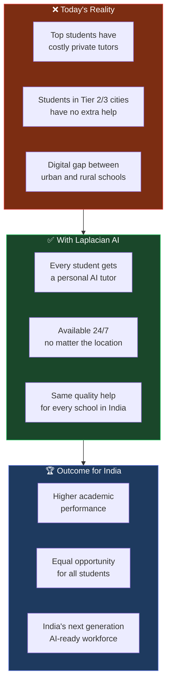

<p align="center">
  
</p>

<h1 align="center">LAPLACIAN AI</h1>
<h3 align="center">by Perfionix AI Technology Pvt Ltd</h3>

<p align="center">
  <em>Empowering Every Student. Elevating Every Classroom.</em>
</p>

<p align="center">
  
  
  
</p>

---

<p align="center">
  <strong>OFFICIAL SCHOOL OUTREACH DOCUMENT</strong><br>
  Prepared for School Teachers, Principals & Academic Coordinators<br>
  <em>Perfionix AI Technology Pvt Ltd · www.perfionixai.com · connect@perfionixai.com</em>
</p>

---

<br>

# How Laplacian AI is Transforming School Education in India

## A Digital Learning Companion for Every Student, Every Subject, Every Day

<br>

---

## Table of Contents

1. [Letter from the Founder](#letter-from-the-founder)
2. [Executive Summary](#executive-summary)
3. [The Challenge in Today's Classrooms](#the-challenge-in-todays-classrooms)
4. [What is Laplacian AI?](#what-is-laplacian-ai)
5. [How Laplacian AI Helps Students](#how-laplacian-ai-helps-students)
6. [How Laplacian AI Helps Teachers](#how-laplacian-ai-helps-teachers)
7. [Subject-Wise Use Cases](#subject-wise-use-cases)
8. [Key Features for Schools](#key-features-for-schools)
9. [Student Safety & Privacy](#student-safety--privacy)
10. [Getting Started](#getting-started)
11. [About Perfionix AI](#about-perfionix-ai)

---

<br>

## Letter from the Founder

<br>

> *Dear Respected Teachers and Principals,*
>
> *Education is the foundation on which India's future is built. As someone who grew up navigating textbooks, doubt-clearing sessions, and late-night exam preparations, I deeply understand what students go through every single day.*
>
> *When I founded Perfionix AI, I had one mission: to make powerful AI tools accessible, safe, and genuinely useful — not just for corporations, but for the students and teachers who need them most.*
>
> **Laplacian AI** *is our gift to India's classrooms. It is a fully AI-powered digital assistant that helps students understand complex topics, complete their projects, learn to code, analyze data, and get answers — any time, day or night.*
>
> *To every teacher reading this: you are already doing the most important work in the world. Laplacian AI is here to be your assistant, your students' tutor, and your school's digital partner.*
>
> *Together, let us give every Indian student the education they deserve.*
>
> — **Shubham Rahangdale**
> Founder & CEO, Perfionix AI Technology Pvt Ltd

<br>

---

## Executive Summary

<br>

| | |
|---|---|
| **Product Name** | Laplacian AI |
| **Developed By** | Perfionix AI Technology Pvt Ltd |
| **Founder** | Shubham Rahangdale |
| **Target Users** | School Students (Class 6–12), Teachers, Academic Staff |
| **Core Purpose** | AI-powered digital learning assistant |
| **Access** | Web browser (laptop, tablet, phone) · No app download needed |
| **Data Safety** | Google-secured login · No data shared with third parties |
| **Language** | English (Hindi interface coming soon) |

<br>

Laplacian AI is an **all-in-one AI workspace** that acts as a personal tutor, research assistant, data analyst, and coding teacher — available 24/7, right from the school computer lab or a student's mobile browser.

It is built in India, for India, with privacy and affordability at its core.

<br>

---

## The Challenge in Today's Classrooms

<br>

Indian schools are producing some of the world's brightest students. But inside every classroom, there are real, everyday challenges that hold students back:

<br>

```
┌─────────────────────────────────────────────────────────────────────┐
│                   COMMON STUDENT STRUGGLES                          │
├────────────────────────┬────────────────────────────────────────────┤
│  😟 Problem            │  📌 Real Impact                            │
├────────────────────────┼────────────────────────────────────────────┤
│ Doubt not cleared      │ Concepts remain weak, exam fear increases  │
│ in class               │                                            │
├────────────────────────┼────────────────────────────────────────────┤
│ No access to tutor     │ Students from smaller towns fall behind    │
│ after school hours     │                                            │
├────────────────────────┼────────────────────────────────────────────┤
│ Project research is    │ Students copy-paste without understanding  │
│ just copy-paste        │                                            │
├────────────────────────┼────────────────────────────────────────────┤
│ No hands-on coding     │ Students learn theory but cannot code      │
│ practice               │                                            │
├────────────────────────┼────────────────────────────────────────────┤
│ Data analysis in       │ Students cannot process or visualize data  │
│ projects is manual     │                                            │
├────────────────────────┼────────────────────────────────────────────┤
│ Teachers spend too     │ Less time for personal student attention   │
│ much time on content   │                                            │
└────────────────────────┴────────────────────────────────────────────┘
```

<br>

> **The result:** Students who have access to extra coaching and resources pull ahead. Those who don't, get left behind — not because they are less capable, but because they never had the right tools.

<br>

**Laplacian AI levels this playing field.**

<br>

---

## What is Laplacian AI?

<br>

Laplacian AI is a **secure, AI-powered digital workspace** that students and teachers can access directly from any web browser. Think of it as having a brilliant, patient, always-available tutor sitting beside every student — one who can explain concepts, answer questions, help with projects, teach coding, and even visualize data — all in one place.

<br>

```
┌─────────────────────────────────────────────────────────────────────┐
│                                                                     │
│                       LAPLACIAN AI                                  │
│              Your School's Digital Intelligence Hub                 │
│                                                                     │
│   ┌───────────┐  ┌───────────┐  ┌───────────┐  ┌───────────┐      │
│   │  💬 Chat  │  │ 📄 DocIQ  │  │ 📊 VizIQ  │  │ 💻 Code   │      │
│   │           │  │           │  │           │  │           │      │
│   │   AI      │  │ Document  │  │   Data    │  │   Code    │      │
│   │  Tutor    │  │  Reader   │  │ Analyzer  │  │  Runner   │      │
│   └───────────┘  └───────────┘  └───────────┘  └───────────┘      │
│                                                                     │
│   ┌───────────────────────────────────────────────────────────┐    │
│   │  📝 Productivity  —  Notes · Tasks · Reminders · Stats    │    │
│   └───────────────────────────────────────────────────────────┘    │
│                                                                     │
└─────────────────────────────────────────────────────────────────────┘
```

<br>

---

## How Laplacian AI Helps Students

<br>

### 1. 💬 AI Chat — A 24/7 Personal Tutor

Students can ask **any question, about any subject, at any time** — and get a clear, detailed explanation instantly.

<br>

**What students can do:**

- Ask "Explain Newton's Third Law with a real-life example"
- Say "I don't understand photosynthesis — explain it simply"
- Request "Give me 10 practice questions on the French Revolution"
- Ask for step-by-step solutions to math problems
- Get essay outlines, summaries, and topic explanations

<br>

**Why it is better than a search engine:**

| Google / YouTube | Laplacian AI |
|------------------|--------------|
| Shows many links — student must read and filter | Gives a single, clear, tailored answer |
| No follow-up — student reads alone | Student can ask follow-up questions instantly |
| Copy-paste temptation | AI explains so student actually understands |
| No personalization | Remembers the conversation context |

<br>

> **Example:** A Class 9 student struggling with quadratic equations can type: *"I don't understand how to use the quadratic formula. Explain it step by step with an example"* — and receive a clear, structured explanation with worked examples, instantly, at 10 PM before an exam.

<br>

---

### 2. 📄 DocIQ — Upload Your Notes, Ask Questions

Students can **upload any PDF, textbook chapter, or notes file** and ask questions about it directly.

<br>

**How it works for students:**

```
Step 1 → Upload your PDF textbook chapter, handout, or notes
Step 2 → Ask any question: "What are the main causes of World War 1?"
Step 3 → Laplacian AI reads your document and answers with structured points
Step 4 → Ask follow-up: "Compare the roles of Britain and Germany"
Step 5 → Get a table comparison with key facts
```

<br>

**Student benefits:**
- No more reading the entire chapter to find one answer
- Instant summaries of long chapters
- Study notes auto-generated from textbook PDFs
- Compare and contrast across multiple documents
- Revision made 5x faster

<br>

**Teacher benefits:**
- Upload question papers, study material, or lesson plans
- Ask the AI to summarize, restructure, or generate quizzes from the content
- Create structured study guides in minutes

<br>

> **Example for Teachers:** Upload your 40-page Geography notes PDF. Ask *"Generate 20 short-answer questions from this document for Class 10 students."* Laplacian AI reads your document and gives you a ready question bank in 30 seconds.

<br>

---

### 3. 📊 VizIQ — Turn Data into Dashboards

For students doing **science projects, surveys, economics assignments, or statistics** — VizIQ transforms raw data into professional charts and analysis automatically.

<br>

**How it helps students:**

```
Step 1 → Collect survey data (Google Form results, Excel, CSV)
Step 2 → Upload the file to VizIQ
Step 3 → Laplacian AI generates:
         → KPI Summary Cards (Total responses, averages, trends)
         → Bar Charts, Pie Charts, Line Graphs
         → Scatter Plot (correlation analysis)
         → AI Insights ("60% of respondents prefer...")
Step 4 → Download charts as PNG images for the project
Step 5 → Export the data as CSV for the report
```

<br>

**Perfect for:**
- Science fair projects with experimental data
- Social science surveys and population studies
- Economics assignments on market trends
- Geography data on rainfall, temperature, population
- Annual school event data analysis

<br>

> **Before Laplacian AI:** A student spends 3 hours drawing bar charts on Excel, making errors, starting over.
>
> **After Laplacian AI:** Upload the file → Professional dashboard with 5 chart types in 10 seconds → Download and paste into the project report.

<br>

---

### 4. 💻 Code Runner — Learn Programming by Doing

Students learning programming in Class 11/12 (Python, C++) or participating in coding competitions can **write, run, and debug code** directly inside Laplacian AI — no setup, no installation needed.

<br>

**Supported languages:**

`Python` · `JavaScript` · `C` · `C++` · `Java` · `Rust` · `Go` · `Ruby` · `PHP` · `TypeScript` and more

<br>

**How students use it:**

- Write Python code for Computer Science practicals
- Run programs instantly and see output
- Ask the AI "Why is my code giving an error?" — get explained fixes
- Learn algorithms by asking "Show me bubble sort in Python with comments"
- Prepare for CBSE practicals, competitive programming, and Olympiads

<br>

**No downloads. No configuration. Works in the school computer lab browser.**

<br>

---

### 5. 📝 Productivity Suite — Stay Organized, Score Better

Built-in tools to help students manage their academic life:

<br>

| Tool | How Students Use It |
|------|---------------------|
| **📋 Tasks** | Add all pending assignments with priority levels. Check off as completed. Never miss a submission. |
| **📓 Notes** | Quick notes during class or while studying. Always available, never lost. |
| **⏰ Reminders** | Set reminders for exam dates, project deadlines, and teacher meetings. |
| **📊 Stats** | See how many tasks completed vs. pending — visualize your progress. |

<br>

---

## How Laplacian AI Helps Teachers

<br>

Laplacian AI is not just for students. It is a powerful tool that **saves teachers hours every week** and enables them to deliver better lessons.

<br>

### What Teachers Can Do with Laplacian AI

<br>

```
┌─────────────────────────────────────────────────────────────────────┐
│                    TEACHER USE CASES                                │
├─────────────────────────────────────────────────────────────────────┤
│                                                                     │
│  📋 LESSON PREPARATION                                              │
│     → "Create a 45-minute lesson plan for Class 8 on Cell Division" │
│     → "Give me 5 real-life examples of Newton's Laws"              │
│     → "Generate an analogy to explain photosynthesis to Class 6"   │
│                                                                     │
├─────────────────────────────────────────────────────────────────────┤
│                                                                     │
│  📝 QUESTION PAPER CREATION                                         │
│     → Upload the syllabus PDF → "Generate 30 MCQs for Chapter 5"  │
│     → "Create 5 long answer questions on the Mughal Empire"        │
│     → "Give me 10 application-based questions on quadratic eqs"    │
│                                                                     │
├─────────────────────────────────────────────────────────────────────┤
│                                                                     │
│  📊 STUDENT PERFORMANCE ANALYSIS                                    │
│     → Upload marks sheet CSV → VizIQ shows class performance       │
│     → Identify which students are below average                    │
│     → Visualize subject-wise performance trends                    │
│                                                                     │
├─────────────────────────────────────────────────────────────────────┤
│                                                                     │
│  📄 REPORT & DOCUMENT DRAFTING                                      │
│     → "Draft a parent communication letter about exam schedule"    │
│     → "Summarize this 20-page curriculum document for me"          │
│     → "Write feedback comments for student progress reports"       │
│                                                                     │
├─────────────────────────────────────────────────────────────────────┤
│                                                                     │
│  🔍 INSTANT RESEARCH                                                │
│     → Real-time web search integrated — AI cites sources           │
│     → "What are the latest changes in CBSE Class 10 syllabus?"    │
│     → "Find current statistics on climate change for my lesson"    │
│                                                                     │
└─────────────────────────────────────────────────────────────────────┘
```

<br>

### Time Saved for Teachers Per Week

<br>

| Task | Without Laplacian AI | With Laplacian AI | Time Saved |
|------|----------------------|-------------------|------------|
| Lesson planning (1 topic) | 2–3 hours | 20 minutes | **~2 hours** |
| Question paper (30 Qs) | 3–4 hours | 15 minutes | **~3.5 hours** |
| Student data analysis | 2 hours | 5 minutes | **~2 hours** |
| Drafting parent letters | 45 minutes | 5 minutes | **~40 minutes** |
| Chapter summarization | 1 hour | 5 minutes | **~55 minutes** |
| **Total per week** | **~10 hours** | **~50 minutes** | **~9 hours saved** |

<br>

> **9 hours saved every week** = More time for actual teaching, student attention, and personal rest.

<br>

---

## Subject-Wise Use Cases

<br>

### 🔬 Science (Physics, Chemistry, Biology)

```
Student: "Explain the difference between mitosis and meiosis with a diagram"
AI:      → Clear explanation with bullet points
          → Auto-generated Mermaid diagram showing the two processes
          → Comparison table

Student: "I got 72% in my bio test but don't know what to revise"
AI:      → "Which chapters were tested? Tell me your weak topics"
          → Generates a targeted revision plan
```

<br>

### ➗ Mathematics

```
Student: "Solve this: If 2x + 3y = 12 and x - y = 1, find x and y"
AI:      → Step-by-step solution with explanation at each step
          → "Let me check if you understand — what is the first step?"

Student: "Explain integration for beginners"
AI:      → Simple analogy, worked examples, practice questions
          → "Try this problem and I will check your approach"
```

<br>

### 📚 Social Science & History

```
Student: "Summarize the causes of the First World War in 5 bullet points"
AI:      → Clean, exam-ready bullet point summary

Student: "Create a timeline of Indian Independence Movement"
AI:      → Auto-generates a visual Mermaid timeline diagram
          → Key dates, events, and leaders — structured for revision
```

<br>

### 💻 Computer Science

```
Student: "Write a Python program to find the factorial of a number"
AI:      → Clean, commented Python code
          → Runs the code instantly → Shows output
          → "Now try to modify it to handle negative numbers"

Student: "Explain what a stack data structure is"
AI:      → Simple analogy ("like a stack of plates")
          → Code example in Python
          → Visual ASCII diagram
```

<br>

### 📈 Commerce & Economics

```
Student: Upload survey data CSV → VizIQ generates:
          → Bar chart: "Consumer preference by age group"
          → Pie chart: "Market share distribution"
          → Trend line: "Monthly spending patterns"
          → AI Insight: "18–25 age group drives 48% of spending"
          → Download all charts for the economics project report
```

<br>

### 🌍 English & Languages

```
Student: "Check my essay on climate change and suggest improvements"
AI:      → Identifies weak arguments, unclear sentences
          → Suggests better vocabulary and structure
          → Rewrites weak paragraphs as examples

Student: "Explain the theme of loss in the poem 'The Road Not Taken'"
AI:      → Deep literary analysis with textual evidence
          → Comparison with the poet's life context
```

<br>

---

## Key Features for Schools

<br>

### Feature Overview

```
┌────────────────────────────────────────────────────────────────────┐
│  FEATURE              │  STUDENT BENEFIT                           │
├───────────────────────┼────────────────────────────────────────────┤
│  AI Chat              │  24/7 doubt clearing, any subject          │
│  Multi-session Chat   │  Separate chats for each subject/topic     │
│  Web Search           │  Latest information with cited sources     │
│  Image Upload         │  Take photo of textbook problem, get help  │
│  DocIQ                │  Ask questions about uploaded PDFs/notes   │
│  Document Summary     │  Summarize entire chapters in seconds      │
│  VizIQ Dashboard      │  Professional data charts for projects     │
│  Chart Download       │  Save charts as images for reports         │
│  Filter & Slicers     │  Explore data interactively like Power BI  │
│  Export CSV           │  Download analyzed data for reports        │
│  Code Execution       │  Run Python, C++, Java in the browser      │
│  Mermaid Diagrams     │  Auto-generate flowcharts and timelines    │
│  Notes                │  Organized digital notes per subject       │
│  Tasks                │  Assignment tracking with priorities       │
│  Reminders            │  Exam and deadline alerts                  │
│  PWA Support          │  Install on phone like an app              │
└────────────────────────────────────────────────────────────────────┘
```

<br>

### Works on Every Device

| Device | Access Method | Requirements |
|--------|--------------|--------------|
| School Computer (Lab) | Chrome / Firefox browser | Internet connection |
| Student Laptop | Any modern browser | Internet connection |
| Android Phone | Chrome browser or Install as PWA | Internet connection |
| iPhone / iPad | Safari browser or Add to Home Screen | Internet connection |

> **No app download required.** Open the browser, go to the Laplacian AI link, log in with Google — done.

<br>

---

## Student Safety & Privacy

<br>

We understand that schools and parents have serious concerns about student safety online. Laplacian AI is designed with privacy and safety at every level.

<br>

```
┌─────────────────────────────────────────────────────────────────────┐
│                     SAFETY COMMITMENTS                              │
├─────────────────────────────────────────────────────────────────────┤
│                                                                     │
│  🔐  LOGIN via Google — No new username/password to remember        │
│      Students login with their school Google account safely         │
│                                                                     │
│  🛡️  NO DATA SHARING — Student conversations are not shared         │
│      or sold to any third party                                     │
│                                                                     │
│  👤  SESSION ISOLATED — Each student's data is completely           │
│      separate from others                                           │
│                                                                     │
│  🚫  NO ADS — Laplacian AI shows zero advertisements               │
│                                                                     │
│  📵  NO SOCIAL FEATURES — No chat between students,                 │
│      no public feed, no social pressure                             │
│                                                                     │
│  🔒  ENCRYPTED — All data transmitted securely (HTTPS)             │
│                                                                     │
│  🇮🇳  INDIA-FIRST — Built and operated by an Indian company,        │
│      aligned with DPDP Act 2023 data protection principles          │
│                                                                     │
└─────────────────────────────────────────────────────────────────────┘
```

<br>

### Responsible AI Use — What We Teach Students

Laplacian AI is not about copying answers. It is about **learning with AI assistance**.

The platform is designed to:
- **Explain** concepts so students understand, not just copy
- **Ask follow-up questions** that deepen understanding
- **Guide** step-by-step rather than hand over final answers
- **Encourage** students to attempt first, then verify

> *"Give a student a fish, and they eat for a day. Teach a student to ask the right questions, and they learn for a lifetime."*
> — Perfionix AI's guiding principle for education

<br>

---

## Getting Started

<br>

### For Schools — 3 Simple Steps

<br>

```
┌─────────────────────────────────────────────────────────────────────┐
│                                                                     │
│   STEP 1                                                            │
│   ───────────────────────────────────────────────────              │
│   Contact Perfionix AI for a School Demo                           │
│   📧  connect@perfionixai.com                                       │
│   🌐  www.perfionixai.com                                           │
│                                                                     │
│   We will schedule a free 30-minute live demonstration             │
│   for your teachers and students.                                  │
│                                                                     │
├─────────────────────────────────────────────────────────────────────┤
│                                                                     │
│   STEP 2                                                            │
│   ───────────────────────────────────────────────────              │
│   Pilot Program in Your School                                      │
│                                                                     │
│   We onboard one class or one department first.                    │
│   Students get access via their Google school account.             │
│   Teachers get a guided walkthrough and support.                   │
│                                                                     │
├─────────────────────────────────────────────────────────────────────┤
│                                                                     │
│   STEP 3                                                            │
│   ───────────────────────────────────────────────────              │
│   School-Wide Rollout                                               │
│                                                                     │
│   Based on pilot feedback, expand to all classes.                  │
│   Dedicated support from our team.                                 │
│   Regular updates and new features — at no extra cost.             │
│                                                                     │
└─────────────────────────────────────────────────────────────────────┘
```

<br>

### For Individual Students — Start in 60 Seconds

```
1. Open any web browser
2. Go to the Laplacian AI link provided by your school
3. Click "Sign in with Google"
4. Use your school Google account
5. Start asking questions — your AI tutor is ready
```

<br>

### For Teachers — First Day Checklist

- [ ] Log in with your Google account
- [ ] Open **AI Chat** — ask it to create a lesson plan for your next class
- [ ] Upload one PDF chapter to **DocIQ** — ask it to generate 10 questions
- [ ] Open **VizIQ** — upload any CSV and explore the auto-generated dashboard
- [ ] Add your next exam date as a **Reminder**
- [ ] Share the access link with your students

<br>

---

## Frequently Asked Questions

<br>

**Q: Does the student need to install anything?**
No. Laplacian AI works entirely in the web browser. Open the link, log in with Google, and start using it.

**Q: Is it safe for students below 18?**
Yes. There are no social features, no ads, no content generated outside the student's own queries. All conversations are private and session-isolated.

**Q: Will students use it to cheat on assignments?**
Laplacian AI is designed to explain and guide, not to produce ready-made assignments. Teachers can set AI-aware assignments that ask for process, reflection, and personal examples — which AI cannot provide for the student.

**Q: Does it work in Hindi or regional languages?**
Currently in English. Hindi and regional language support is in active development.

**Q: What if our school does not have fast internet?**
The platform is lightweight and works on standard school broadband connections. It does not require video streaming or heavy downloads.

**Q: Is there a cost for schools?**
Please contact us at connect@perfionixai.com for school pricing, partnership programs, and free pilot arrangements.

**Q: Can teachers control what students access?**
Yes. School administrators can configure access levels. We also provide teacher dashboards in our upcoming enterprise version.

<br>

---

## The Bigger Picture — Why This Matters for India

<br>



<br>

India has **26 crore school students**. The gap between students who can afford extra coaching and those who cannot is one of the most urgent education challenges of our time.

Laplacian AI is our answer to that challenge — a tool that gives every student in every corner of India access to the same quality of guidance, explanation, and support that previously only money could buy.

<br>

---

## About Perfionix AI

<br>

```
┌─────────────────────────────────────────────────────────────────────┐
│                                                                     │
│   🏢  Perfionix AI Technology Pvt Ltd                               │
│                                                                     │
│   🧑‍💼  Founder & CEO   :  Shubham Rahangdale                        │
│   🇮🇳  Headquarters    :  India                                      │
│   🌐  Website         :  www.perfionixai.com                        │
│   📧  Email           :  connect@perfionixai.com                    │
│   🏷️  Product         :  Laplacian AI — Enterprise AI Workspace     │
│                                                                     │
│   Our Mission:                                                      │
│   ─────────────────────────────────────────────────────────        │
│   To democratize AI tools for every Indian — from the boardroom    │
│   to the classroom — building technology that is safe, powerful,   │
│   and proudly Made in India.                                        │
│                                                                     │
└─────────────────────────────────────────────────────────────────────┘
```

<br>

Perfionix AI was founded with the belief that artificial intelligence should not be a privilege of the elite — it should be a right of every student, every professional, and every organization in India.

Our flagship product, **Laplacian AI**, is used across enterprises, startups, and now schools — bringing the power of GPT-level AI to Indian users in a safe, private, and locally-operated platform.

We are committed to:
- Building AI that respects Indian data privacy laws
- Pricing our tools affordably for Indian schools and institutions
- Supporting educators with free training, demos, and onboarding
- Continuously improving based on real teacher and student feedback

<br>

---

## Contact Us

<br>

We would love to bring Laplacian AI to your school. Reach out to us for a **free demonstration, pilot program, or any questions**.

<br>

| | |
|---|---|
| 📧 **Email** | connect@perfionixai.com |
| 🌐 **Website** | www.perfionixai.com |
| 📍 **Location** | India |
| 👤 **Founder** | Shubham Rahangdale |

<br>

> *"We do not just build AI. We build the future — one student at a time."*
> — Shubham Rahangdale, Founder, Perfionix AI

<br>

---

<p align="center">
  
</p>

<p align="center">
  <strong>LAPLACIAN AI</strong> — by Perfionix AI Technology Pvt Ltd<br>
  <em>Empowering Every Student. Elevating Every Classroom.</em>
</p>

<p align="center">
  www.perfionixai.com · connect@perfionixai.com
</p>

<p align="center">
  <strong>© 2026 Perfionix AI Technology Pvt Ltd. All rights reserved.</strong><br>
  <em>Made with ❤️ in India</em>
</p>
